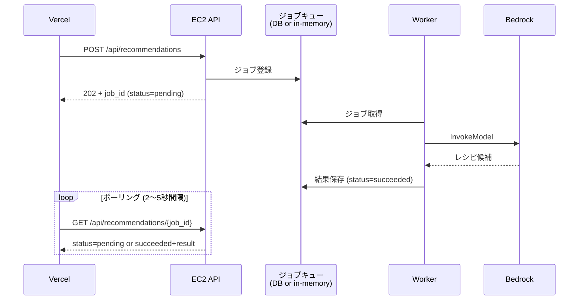

# API設計書

家庭用 在庫管理・献立支援システム

---

## 1. 共通仕様

### 1.1 ベースURL
| 環境 | URL |
|------|-----|
| 本番 | `https://api.example.com` |
| ステージング | `https://api-stg.example.com` |
| ローカル | `http://localhost:3000` |

すべてのエンドポイントは `/api` プレフィックスを持つ（例：`https://api.example.com/api/inventory`）。

### 1.2 認証

すべてのAPI（`/api/health` 等の公開エンドポイントを除く）でJWT認証必須。

```
Authorization: Bearer <Cognito ID Token>
```

サーバ側は `aws-jwt-verify` 等で署名・issuer・audience・expを検証する。検証失敗時は `401 Unauthorized` を返却。

### 1.3 リクエスト/レスポンス形式

| 項目 | 仕様 |
|------|------|
| Content-Type | `application/json; charset=utf-8` |
| 文字コード | UTF-8 |
| 日付形式 | ISO 8601（`2026-05-07` / `2026-05-07T12:34:56Z`） |
| タイムゾーン | サーバ・DB は UTC、表示はクライアント側で変換 |

### 1.4 共通レスポンスエンベロープ

成功時：
```json
{
  "data": { ... } または [ ... ]
}
```

リスト系（ページネーションあり）：
```json
{
  "data": [ ... ],
  "pagination": {
    "page": 1,
    "per_page": 20,
    "total": 153,
    "total_pages": 8
  }
}
```

非同期ジョブ系：
```json
{
  "data": {
    "job_id": "rec_01H...",
    "status": "pending"
  }
}
```

### 1.5 エラーレスポンス

```json
{
  "error": {
    "code": "VALIDATION_ERROR",
    "message": "quantity must be greater than 0",
    "details": [
      { "field": "quantity", "reason": "min_value" }
    ]
  }
}
```

| HTTP | code | 用途 |
|------|------|------|
| 400 | `VALIDATION_ERROR` | 入力値不正 |
| 401 | `UNAUTHORIZED` | JWT無効・未設定 |
| 403 | `FORBIDDEN` | 他ユーザーのリソースへのアクセス等 |
| 404 | `NOT_FOUND` | リソース未存在 |
| 409 | `CONFLICT` | 重複・整合性違反 |
| 429 | `RATE_LIMITED` | レート上限超過 |
| 500 | `INTERNAL_ERROR` | 想定外のサーバエラー |
| 503 | `SERVICE_UNAVAILABLE` | LLM等の依存サービス障害 |

### 1.6 ページネーション（オフセット方式）

リスト系APIの共通クエリパラメータ：

| パラメータ | 型 | 既定 | 説明 |
|-----------|-----|------|------|
| page | int | 1 | ページ番号（1始まり） |
| per_page | int | 20 | 1ページあたり件数（最大100） |

### 1.7 共通ヘッダ

| ヘッダ | 用途 |
|--------|------|
| `Authorization` | Bearer JWT（必須） |
| `X-Request-Id` | リクエスト追跡用（クライアント任意、サーバ側で発行も可） |
| `Accept-Language` | `ja` / `en` 等。LLM応答の言語切替に使用（任意） |

### 1.8 CORS

Vercel本番ドメイン・プレビュードメイン・ローカルからのアクセスのみ許可。

```
Access-Control-Allow-Origin: <許可リストから一致したものをエコー>
Access-Control-Allow-Methods: GET, POST, PATCH, DELETE, OPTIONS
Access-Control-Allow-Headers: Authorization, Content-Type, X-Request-Id
Access-Control-Allow-Credentials: false
Access-Control-Max-Age: 86400
```

### 1.9 レート制限

| 種別 | 上限 |
|------|------|
| 一般API | 60 req/min/user |
| LLM提案 (`POST /api/recommendations`) | 10 req/hour/user |

超過時は `429 RATE_LIMITED` を返却。

---

## 2. ユーザー / プロフィール

### 2.1 GET /api/me
自分のユーザー情報を取得。**初回呼び出し時にJIT方式で `users` レコードを作成する**。

#### Request
（パラメータなし）

#### Response 200
```json
{
  "data": {
    "id": 1,
    "email": "user@example.com",
    "display_name": "たろう",
    "provider": "cognito",
    "created_at": "2026-05-01T10:00:00Z",
    "updated_at": "2026-05-07T03:21:11Z"
  }
}
```

### 2.2 PATCH /api/me
プロフィール更新。

#### Request
```json
{
  "display_name": "たろう改"
}
```

#### Response 200
（更新後のユーザー情報を `GET /api/me` と同形式で返却）

### 2.3 DELETE /api/me
アカウント論理削除（退会）。`users.deleted_at` を設定し、関連データも論理削除。Cognito側のユーザーは別途削除が必要（運用バッチ or アプリで連動削除）。

#### Response 204
（ボディなし）

---

## 3. カテゴリ

### 3.1 GET /api/categories
カテゴリマスタ一覧を取得。

#### Query
| パラメータ | 型 | 説明 |
|-----------|-----|------|
| type | string | `food` / `seasoning` / `daily` でフィルタ（任意） |

#### Response 200
```json
{
  "data": [
    { "id": 1, "name": "野菜",       "type": "food",      "default_storage_location": "fridge" },
    { "id": 2, "name": "肉",         "type": "food",      "default_storage_location": "fridge" },
    { "id": 5, "name": "冷凍食品",   "type": "food",      "default_storage_location": "freezer" },
    { "id": 8, "name": "醤油・味噌", "type": "seasoning", "default_storage_location": "pantry" },
    { "id": 9, "name": "米・麺",     "type": "food",      "default_storage_location": null }
  ]
}
```

| フィールド | 型 | 説明 |
|-----------|-----|------|
| id | int | カテゴリID |
| name | string | カテゴリ名 |
| type | string | `food` / `seasoning` / `daily` |
| default_storage_location | string \| null | 当該カテゴリのデフォルト保管場所。S-203の在庫追加時に保管場所を自動推測するために使用。NULLは推測なし |

---

## 4. 在庫管理

### 4.1 GET /api/inventory
在庫一覧。

#### Query
| パラメータ | 型 | 説明 |
|-----------|-----|------|
| page | int | ページ番号 |
| per_page | int | 1ページ件数 |
| category_id | int | カテゴリで絞り込み(`null` を渡すと未分類のみ) |
| storage_location | string | `fridge` / `freezer` / `pantry` |
| q | string | 商品名の部分一致 |
| sort | string | `name` / `expires_at` / `created_at`（先頭`-`で降順） |

#### ソート挙動の特記事項
- `sort=expires_at`(期限近い順)のとき、`expires_at IS NULL` のレコードは **末尾にまとめて** 返す
- 実装イメージ: `ORDER BY expires_at IS NULL ASC, expires_at ASC`
- `category_id IS NULL`(未分類)の在庫は `category` フィールドに `null` を返却する

#### Response 200
```json
{
  "data": [
    {
      "id": 101,
      "name": "鶏もも肉",
      "category": { "id": 2, "name": "肉" },
      "quantity": 300,
      "unit": "g",
      "purchased_at": "2026-05-05",
      "expires_at": "2026-05-09",
      "storage_location": "fridge",
      "memo": null,
      "created_at": "2026-05-05T18:21:00Z",
      "updated_at": "2026-05-05T18:21:00Z"
    }
  ],
  "pagination": { "page": 1, "per_page": 20, "total": 42, "total_pages": 3 }
}
```

### 4.2 GET /api/inventory/{id}
在庫1件の詳細。

#### Response 200
```json
{
  "data": {
    "id": 101,
    "name": "鶏もも肉",
    "category": { "id": 2, "name": "肉" },
    "quantity": 300,
    "unit": "g",
    "purchased_at": "2026-05-05",
    "expires_at": "2026-05-09",
    "storage_location": "fridge",
    "memo": null,
    "created_at": "2026-05-05T18:21:00Z",
    "updated_at": "2026-05-05T18:21:00Z"
  }
}
```

### 4.3 POST /api/inventory
在庫新規登録。

#### Request
```json
{
  "name": "鶏もも肉",
  "category_id": 2,
  "quantity": 300,
  "unit": "g",
  "purchased_at": "2026-05-05",
  "expires_at": "2026-05-09",
  "storage_location": "fridge",
  "memo": null
}
```

| フィールド | 型 | 必須 | 制約 |
|-----------|-----|------|------|
| name | string | ○ | 1〜100文字 |
| category_id | int \| null | × | 存在するカテゴリID。**未指定 or null は「未分類」扱い** |
| quantity | number | ○ | > 0、小数2桁まで |
| unit | string | ○ | `個`/`g`/`kg`/`ml`/`l`/`本`/`枚`等 |
| purchased_at | date | × | YYYY-MM-DD |
| expires_at | date | × | YYYY-MM-DD、過去日も許容 |
| storage_location | string | × | `fridge`/`freezer`/`pantry` |
| memo | string | × | 最大500文字 |

#### Response 201
（登録後のリソースを `GET /api/inventory/{id}` と同形式で返却）

### 4.4 PATCH /api/inventory/{id}
在庫更新。送信したフィールドのみ更新。数量の増減もこのAPI。

#### Request 例（数量だけ更新）
```json
{ "quantity": 200 }
```

#### Response 200
（更新後のリソースを返却）

### 4.5 DELETE /api/inventory/{id}
在庫削除（論理削除）。

#### Response 204
（ボディなし）

### 4.6 GET /api/inventory/expiring
期限切れ間近の在庫一覧。アラート表示用。

#### Query
| パラメータ | 型 | 既定 | 説明 |
|-----------|-----|------|------|
| within_days | int | 3 | N日以内に期限切れ（負値で既に切れたもの含む） |

#### Response 200
```json
{
  "data": [
    {
      "id": 101,
      "name": "鶏もも肉",
      "expires_at": "2026-05-09",
      "days_remaining": 2,
      "category": { "id": 2, "name": "肉" }
    }
  ]
}
```

### 4.7 POST /api/inventory/{id}/restore
論理削除済みの在庫を復元する。S-201 のスワイプ「使い切った」を取り消す動線で使用。

#### Request
（ボディなし）

#### Response 200
```json
{
  "data": {
    "id": 101,
    "name": "鶏もも肉",
    "category": { "id": 2, "name": "肉" },
    "quantity": 300,
    "unit": "g",
    "purchased_at": "2026-05-05",
    "expires_at": "2026-05-09",
    "storage_location": "fridge",
    "memo": null,
    "created_at": "2026-05-05T18:21:00Z",
    "updated_at": "2026-05-08T14:20:30Z"
  }
}
```

#### エラー
| HTTP | code | 説明 |
|------|------|------|
| 404 | NOT_FOUND | 該当レコードが物理的に存在しない、または他ユーザーのリソース |
| 409 | CONFLICT | 既に復元済み(`deleted_at IS NULL`) |

#### 仕様
- `deleted_at` を `NULL` に戻す処理
- 認可: 自分のリソースのみ復元可
- 取り消しの実用上、削除直後の連続呼び出しを想定

### 4.8 GET /api/inventory/suggest
S-203 在庫追加で使う商品名サジェスト。過去の登録履歴から、入力文字列に部分一致する商品名を返す。重複は除外する。

#### Query
| パラメータ | 型 | 必須 | 既定 | 説明 |
|-----------|-----|------|------|------|
| q | string | ○ | - | 部分一致クエリ(1文字以上) |
| limit | int | × | 5 | 最大件数(1〜10) |

#### Response 200
```json
{
  "data": [
    {
      "name": "鶏もも肉",
      "frequent_category": { "id": 2, "name": "肉" },
      "frequent_storage_location": "fridge",
      "last_used_at": "2026-05-01T18:00:00Z"
    },
    {
      "name": "鶏むね肉",
      "frequent_category": { "id": 2, "name": "肉" },
      "frequent_storage_location": "fridge",
      "last_used_at": "2026-04-22T18:00:00Z"
    }
  ]
}
```

| フィールド | 型 | 説明 |
|-----------|-----|------|
| name | string | 商品名(過去履歴の同名商品をユニーク化) |
| frequent_category | object \| null | 過去登録での最頻カテゴリ |
| frequent_storage_location | string \| null | 過去登録での最頻保管場所 |
| last_used_at | datetime | 最終登録日時(新しい順に並ぶ) |

#### 仕様
- 過去30日以内に登録した在庫を対象(論理削除済みも含む履歴ベース)
- `name` の重複は除外、最新の登録を代表として返す
- 最頻値の決定: 過去登録のうち最頻のカテゴリ・保管場所(同数の場合は最新)
- 並び順: `last_used_at` の降順
- パフォーマンス上の上限あり(全件スキャンしない、直近100件程度を母集団とする)

### 4.9 GET /api/inventory/summary
S-101 ホームで在庫の状況を軽量に取得する集計エンドポイント。

#### Request
（パラメータなし）

#### Response 200
```json
{
  "data": {
    "total_count": 12,
    "expiring_count": 2,
    "expired_count": 0,
    "no_expiry_count": 5
  }
}
```

| フィールド | 型 | 説明 |
|-----------|-----|------|
| total_count | int | 全在庫件数(`deleted_at IS NULL`) |
| expiring_count | int | 期限が3日以内に切れるもの(0日含む、過去は含まない) |
| expired_count | int | 既に期限切れ(過去日) |
| no_expiry_count | int | 期限未入力 |

#### 用途
- ホームの提案CTA文言生成(「在庫12件 · うち2件が期限間近」)
- 提案CTAの活性/非活性判定(`total_count >= 3`)
- 期限間近セクションの「件数バッジ」表示

---

## 5. レシピ管理

### 5.1 GET /api/recipes
保存済みレシピ一覧。

#### Query
| パラメータ | 型 | 説明 |
|-----------|-----|------|
| page | int | |
| per_page | int | |
| genre | string | `japanese`/`western`/`chinese` |
| source | string | `manual`/`llm` |
| q | string | タイトル部分一致 |

#### Response 200
```json
{
  "data": [
    {
      "id": 501,
      "title": "鶏の照り焼き",
      "cooking_time_min": 25,
      "genre": "japanese",
      "source": "llm",
      "created_at": "2026-05-06T10:00:00Z"
    }
  ],
  "pagination": { "page": 1, "per_page": 20, "total": 12, "total_pages": 1 }
}
```

### 5.2 GET /api/recipes/{id}
レシピ詳細（材料・手順込み）。

#### Response 200
```json
{
  "data": {
    "id": 501,
    "title": "鶏の照り焼き",
    "cooking_time_min": 25,
    "genre": "japanese",
    "source": "llm",
    "ingredients": [
      { "id": 1, "name": "鶏もも肉", "quantity": 300, "unit": "g" },
      { "id": 2, "name": "醤油",     "quantity": 30,  "unit": "ml" },
      { "id": 3, "name": "みりん",   "quantity": 30,  "unit": "ml" }
    ],
    "steps": [
      { "id": 1, "step_no": 1, "description": "鶏肉を一口大に切る", "duration_min": 3 },
      { "id": 2, "step_no": 2, "description": "フライパンで皮目から焼く", "duration_min": 7 },
      { "id": 3, "step_no": 3, "description": "調味料を加えて煮絡める", "duration_min": 5 }
    ],
    "created_at": "2026-05-06T10:00:00Z",
    "updated_at": "2026-05-06T10:00:00Z"
  }
}
```

### 5.3 POST /api/recipes
レシピ新規登録（手動 or LLM提案から保存）。

#### Request
```json
{
  "title": "鶏の照り焼き",
  "cooking_time_min": 25,
  "genre": "japanese",
  "source": "llm",
  "ingredients": [
    { "name": "鶏もも肉", "quantity": 300, "unit": "g" },
    { "name": "醤油",     "quantity": 30,  "unit": "ml" }
  ],
  "steps": [
    { "step_no": 1, "description": "鶏肉を一口大に切る", "duration_min": 3 },
    { "step_no": 2, "description": "フライパンで皮目から焼く", "duration_min": 7 }
  ]
}
```

| フィールド | 型 | 必須 | 制約 |
|-----------|-----|------|------|
| title | string | ○ | 1〜200文字 |
| cooking_time_min | int | × | > 0 |
| genre | string | × | `japanese`/`western`/`chinese`/`other` |
| source | string | ○ | `manual`/`llm` |
| ingredients | array | ○ | 1件以上 |
| steps | array | ○ | 1件以上、`step_no` は連番（1始まり） |

#### Response 201
（登録後のレシピを `GET /api/recipes/{id}` と同形式で返却）

### 5.4 PATCH /api/recipes/{id}
レシピ更新。`ingredients` / `steps` を渡した場合は **全置換**（差分マージではない）。

#### Response 200
（更新後のリソース）

### 5.5 DELETE /api/recipes/{id}
レシピ削除（論理削除）。`recipe_ingredients` / `recipe_steps` も連動論理削除。

#### Response 204

---

## 6. LLMレシピ提案（非同期）

LLM呼び出しはレイテンシが大きく不安定なため、**ジョブベースの非同期API**で実装する。

### フロー


### 6.1 POST /api/recommendations
レシピ提案ジョブを登録。

#### Request
```json
{
  "filters": {
    "max_cooking_time_min": 30,
    "genre": "japanese",
    "prefer_expiring": true
  },
  "count": 3
}
```

| フィールド | 型 | 必須 | 説明 |
|-----------|-----|------|------|
| filters.max_cooking_time_min | int | × | 上限調理時間 |
| filters.genre | string | × | `japanese`/`western`/`chinese`/`other` |
| filters.prefer_expiring | bool | × | 期限切れ間近の食材を優先（既定 false） |
| count | int | × | 提案件数（1〜5、既定 3） |

#### Response 202
```json
{
  "data": {
    "job_id": "rec_01HX9F8QZ7K3R2N",
    "status": "pending",
    "created_at": "2026-05-07T03:30:00Z"
  }
}
```

### 6.2 GET /api/recommendations/{job_id}
ジョブの状態と結果を取得。

#### Response 200（処理中）
```json
{
  "data": {
    "job_id": "rec_01HX9F8QZ7K3R2N",
    "status": "pending",
    "created_at": "2026-05-07T03:30:00Z"
  }
}
```

#### Response 200（完了）
```json
{
  "data": {
    "job_id": "rec_01HX9F8QZ7K3R2N",
    "status": "succeeded",
    "created_at": "2026-05-07T03:30:00Z",
    "completed_at": "2026-05-07T03:30:18Z",
    "latency_ms": 18234,
    "result": {
      "recipes": [
        {
          "title": "鶏の照り焼き",
          "cooking_time_min": 25,
          "genre": "japanese",
          "ingredients": [
            { "name": "鶏もも肉", "quantity": 300, "unit": "g", "from_inventory": true },
            { "name": "醤油",     "quantity": 30,  "unit": "ml", "from_inventory": true }
          ],
          "missing_ingredients": [
            { "name": "白ごま", "quantity": 5, "unit": "g" }
          ],
          "steps": [
            { "step_no": 1, "description": "鶏肉を一口大に切る", "duration_min": 3 }
          ]
        }
      ]
    }
  }
}
```

| status | 意味 |
|--------|------|
| `pending` | キュー登録済み、未着手 |
| `running` | LLM処理中 |
| `succeeded` | 成功、`result` あり |
| `failed` | 失敗、`error` あり |

#### Response 200（失敗）
```json
{
  "data": {
    "job_id": "rec_01HX9F8QZ7K3R2N",
    "status": "failed",
    "error": {
      "code": "LLM_TIMEOUT",
      "message": "Bedrock did not respond within 60 seconds"
    }
  }
}
```

クライアントは推奨ポーリング間隔：初回2秒、以降5秒、最大60秒で打ち切り。

### 6.3 GET /api/recommendations/history
過去の提案履歴一覧。

#### Query
ページネーション標準パラメータ。

#### Response 200
```json
{
  "data": [
    {
      "job_id": "rec_01HX9F8QZ7K3R2N",
      "status": "succeeded",
      "created_at": "2026-05-07T03:30:00Z",
      "filters": { "max_cooking_time_min": 30 },
      "recipe_titles": ["鶏の照り焼き", "親子丼", "鶏のさっぱり煮"]
    }
  ],
  "pagination": { "page": 1, "per_page": 20, "total": 8, "total_pages": 1 }
}
```

詳細は `GET /api/recommendations/{job_id}` で取得。

---

## 7. 献立カレンダー

### 7.1 GET /api/meal-plans
期間指定で献立一覧を取得。

#### Query
| パラメータ | 型 | 必須 | 説明 |
|-----------|-----|------|------|
| from | date | ○ | 開始日（YYYY-MM-DD） |
| to | date | ○ | 終了日（YYYY-MM-DD、from から最大92日） |
| meal_type | string | × | `breakfast`/`lunch`/`dinner`/`snack` |

#### Response 200
```json
{
  "data": [
    {
      "id": 901,
      "plan_date": "2026-05-07",
      "meal_type": "dinner",
      "dish_name": "鶏の照り焼き",
      "recipe": { "id": 501, "title": "鶏の照り焼き" },
      "memo": null,
      "created_at": "2026-05-06T10:30:00Z",
      "updated_at": "2026-05-06T10:30:00Z"
    }
  ]
}
```

### 7.2 GET /api/meal-plans/{id}
献立1件取得。

#### Response 200
（上記 `data` 内の単一オブジェクト）

### 7.3 POST /api/meal-plans
献立登録。

#### Request
```json
{
  "plan_date": "2026-05-07",
  "meal_type": "dinner",
  "dish_name": "鶏の照り焼き",
  "recipe_id": 501,
  "memo": null
}
```

| フィールド | 型 | 必須 | 制約 |
|-----------|-----|------|------|
| plan_date | date | ○ | YYYY-MM-DD |
| meal_type | string | ○ | `breakfast`/`lunch`/`dinner`/`snack` |
| dish_name | string | ○ | 1〜200文字 |
| recipe_id | int | × | 存在するレシピID |
| memo | string | × | 最大500文字 |

#### Response 201
（登録後のリソース）

### 7.4 PATCH /api/meal-plans/{id}
献立更新。

#### Response 200

### 7.5 DELETE /api/meal-plans/{id}
献立削除（論理削除）。

#### Response 204

### 7.6 POST /api/meal-plans/copy
期間指定での献立コピー（前週→今週など）。

#### Request
```json
{
  "from_date": "2026-04-27",
  "to_date":   "2026-05-03",
  "target_start_date": "2026-05-04",
  "overwrite": false
}
```

| フィールド | 型 | 必須 | 説明 |
|-----------|-----|------|------|
| from_date | date | ○ | コピー元期間の開始日 |
| to_date | date | ○ | コピー元期間の終了日 |
| target_start_date | date | ○ | コピー先の開始日 |
| overwrite | bool | × | コピー先に既存献立がある場合に上書きするか（既定 false=スキップ） |

#### Response 200
```json
{
  "data": {
    "copied": 14,
    "skipped": 2,
    "overwritten": 0
  }
}
```

---

## 8. ヘルスチェック（公開）

### 8.1 GET /api/health
JWT不要。死活監視・ALBヘルスチェック用。

#### Response 200
```json
{
  "data": {
    "status": "ok",
    "version": "1.0.0",
    "timestamp": "2026-05-07T03:30:00Z"
  }
}
```

---

## 9. データバリデーション共通ルール

| 項目 | ルール |
|------|--------|
| 文字列の前後空白 | サーバ側でtrim |
| 空文字 vs null | 空文字は基本null扱いに正規化 |
| 数量の小数 | 小数点以下2桁まで（DECIMAL(10,2)） |
| 日付 | 過去・未来とも可（在庫の `expires_at` は過去でも許容） |
| ID | int（数値）で受ける。文字列ID不可 |

### 9.1 単位(unit)の定義

在庫の `unit` で扱う単位とその性質:

| 単位 | カウンタブル | 意味 | 1個使うスワイプ(S-201) |
|------|-------------|------|----------------------|
| `個` | ○ | 個数 | 有効(-1) |
| `本` | ○ | 本数 | 有効(-1) |
| `枚` | ○ | 枚数 | 有効(-1) |
| `g`  | × | グラム | 無効(詳細編集へ誘導) |
| `kg` | × | キログラム | 無効 |
| `ml` | × | ミリリットル | 無効 |
| `l`  | × | リットル | 無効 |

**カウンタブル単位**(`個`/`本`/`枚`)は1ずつ増減する操作が意味を持つ。重量・容積の単位は連続値のため、クイック操作の対象外とする。

---

## 10. 認可ルール

すべての業務リソース（在庫・レシピ・献立・提案履歴）は **JWTの `sub` から解決した user_id** に紐づくものだけアクセス可能。

| ケース | 挙動 |
|--------|------|
| 自分のリソース | アクセス可 |
| 他人のリソース | `404 NOT_FOUND` を返却（存在を漏らさないため `403` ではなく `404`） |
| 削除済み（deleted_at != NULL） | `404 NOT_FOUND` |

---

## 12. バックエンド実装設計
### 12.1 技術スタック

| 項目 | 採用 |
|------|------|
| 言語 | Go 1.22+ |
| HTTPフレームワーク | [chi](https://github.com/go-chi/chi)（軽量・標準net/http互換） |
| DBドライバ | [GORM](https://gorm.io/)（ORM・マイグレーション機能込み） |
| JWT検証 | [lestrrat-go/jwx](https://github.com/lestrrat-go/jwx)（Cognito JWKs対応） |
| 設定管理 | 環境変数 + [godotenv](https://github.com/joho/godotenv)（ローカル開発用） |
| ロガー | [slog](https://pkg.go.dev/log/slog)（Go 1.21標準） |
| DBマイグレーション | [golang-migrate](https://github.com/golang-migrate/migrate) |

---

### 12.2 ディレクトリ構成
backend/
├── cmd/
│   └── api/
│       └── main.go                  # エントリポイント。サーバ起動・DI組み立て
│
├── internal/                        # 外部パッケージからimport不可
│   │
│   ├── config/
│   │   └── config.go                # 環境変数の読み込み・バリデーション
│   │
│   ├── handler/                     # HTTPハンドラ（リクエスト/レスポンス変換のみ）
│   │   ├── router.go                # ルーティング定義（chi）
│   │   ├── me.go                    # GET /api/me, PATCH /api/me, DELETE /api/me
│   │   ├── inventory.go             # /api/inventory/*
│   │   ├── category.go              # GET /api/categories
│   │   ├── recipe.go                # /api/recipes/*
│   │   ├── meal_plan.go             # /api/meal-plans/*
│   │   ├── recommendation.go        # /api/recommendations/*
│   │   └── health.go                # GET /api/health
│   │
│   ├── middleware/
│   │   ├── auth.go                  # JWT検証・ctxへのユーザー情報注入
│   │   ├── cors.go                  # CORSヘッダ設定
│   │   ├── logger.go                # リクエストログ（X-Request-Id付与）
│   │   └── ratelimit.go             # レート制限（§1.9）
│   │
│   ├── service/                     # ビジネスロジック
│   │   ├── user.go                  # JITプロビジョニング・プロフィール更新
│   │   ├── inventory.go             # 在庫CRUD・期限アラート
│   │   ├── category.go              # カテゴリ取得
│   │   ├── recipe.go                # レシピCRUD
│   │   ├── meal_plan.go             # 献立CRUD
│   │   └── recommendation.go        # ジョブ登録・Bedrock呼び出し・結果取得
│   │
│   ├── repository/                  # DB操作（SQLのみ。ロジックは持たない）
│   │   ├── user.go
│   │   ├── inventory.go
│   │   ├── category.go
│   │   ├── recipe.go
│   │   ├── meal_plan.go
│   │   └── recommendation.go
│   │
│   ├── model/                       # DBレコードと対応する構造体・ドメイン型
│   │   ├── user.go
│   │   ├── inventory.go
│   │   ├── category.go
│   │   ├── recipe.go
│   │   ├── meal_plan.go
│   │   └── recommendation.go
│   │
│   ├── cognito/
│   │   └── verifier.go              # JWKsキャッシュ・JWT署名検証ロジック
│   │
│   └── bedrock/
│       └── client.go                # Bedrock InvokeModel ラッパー
│
├── db/
│   └── migrations/                  # golang-migrate用SQLファイル
│       ├── 000001_create_users.up.sql
│       ├── 000001_create_users.down.sql
│       ├── 000002_create_categories.up.sql
│       ├── 000002_create_categories.down.sql
│       └── ...（テーブルごとに連番）
│
├── .env.example                     # 環境変数のサンプル（シークレットは含めない）
├── go.mod
├── go.sum

---

### 12.3 レイヤー責務

| レイヤー | 責務 | 持たないもの |
|---------|------|------------|
| `handler` | リクエスト/レスポンスの変換・バリデーション・HTTPステータス決定 | ビジネスロジック・SQL |
| `service` | ビジネスロジック（JITプロビジョニング・認可チェック等） | HTTP知識・SQL |
| `repository` | SQL発行・DBとのやり取り | ビジネスロジック |
| `model` | 構造体定義（DB行・リクエスト・レスポンス） | メソッド・ロジック |
| `middleware` | 横断的関心事（認証・ログ・CORS・レート制限） | ビジネスロジック |
| `cognito` | JWT検証・JWKsキャッシュ管理 | HTTP routing |
| `bedrock` | Bedrock API呼び出しのラッパー | レシピのビジネスロジック |

---

### 12.4 依存関係
main.go
└─ handler（router）
├─ middleware（auth / cors / logger / ratelimit）
└─ service
├─ repository（DB）
├─ cognito（JWT検証）
└─ bedrock（LLM）

依存は上から下方向のみ。`repository` が `service` を参照するような逆方向の依存は禁止。

---

### 12.5 環境変数一覧

| 変数名 | 説明 | 例 |
|--------|------|-----|
| `PORT` | APIサーバのListenポート | `8080` |
| `DB_DSN` | MySQL接続文字列（Secrets Managerから取得） | `user:pass@tcp(host:3306)/dbname?parseTime=true` |
| `COGNITO_REGION` | CognitoのAWSリージョン | `ap-northeast-1` |
| `COGNITO_USER_POOL_ID` | User Pool ID | `ap-northeast-1_XXXXXXXXX` |
| `COGNITO_CLIENT_ID` | アプリクライアントID | `xxxxxxxxxxxxxxxxxxxxxx` |
| `BEDROCK_REGION` | BedrockのAWSリージョン | `ap-northeast-1` |
| `BEDROCK_MODEL_ID` | 使用するモデルID | `anthropic.claude-3-5-sonnet-20241022-v2:0` |
| `ALLOWED_ORIGINS` | CORS許可オリジン（カンマ区切り） | `https://example.vercel.app,http://localhost:3000` |
| `ENV` | 実行環境 | `production` / `development` |

---

## 13. 改訂履歴

| 版数 | 日付 | 内容 |
|------|------|------|
| 1.0 | 2026-05-07 | 初版作成 |
| 1.1 | 2026-05-08 | 画面詳細設計(S-201/S-203/S-101)からのギャップを反映: <br>・ POST /api/inventory/{id}/restore 追加 <br>・ GET /api/inventory/suggest 追加 <br>・ GET /api/inventory/summary 追加 <br>・ GET /api/categories レスポンスに default_storage_location 追加 <br>・ POST /api/inventory の category_id を NULL 許容に変更 <br>・ GET /api/inventory のソート挙動明文化(期限なしを末尾に) <br>・ 単位(unit)の定義とカウンタブル分類を追加 |
