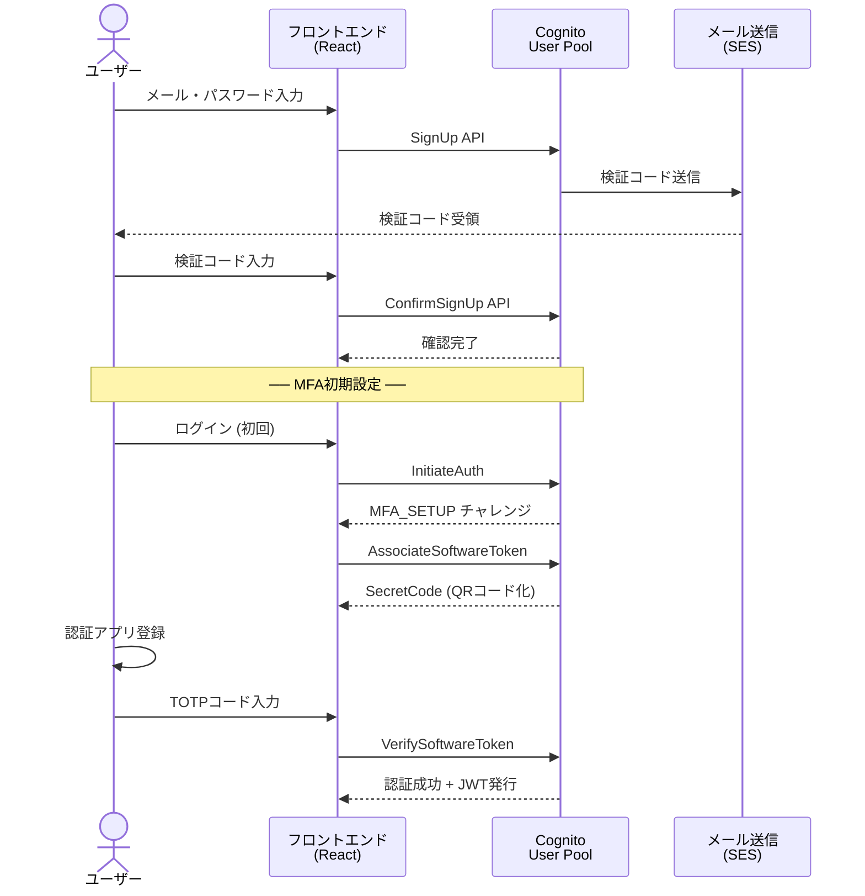
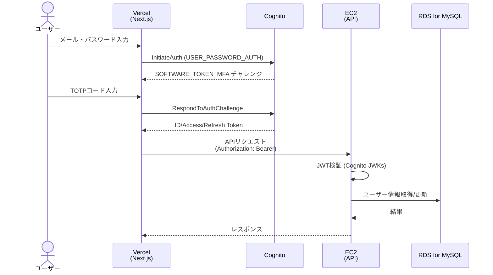
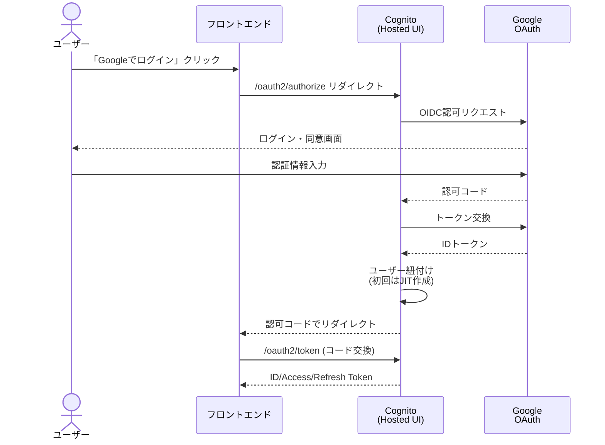
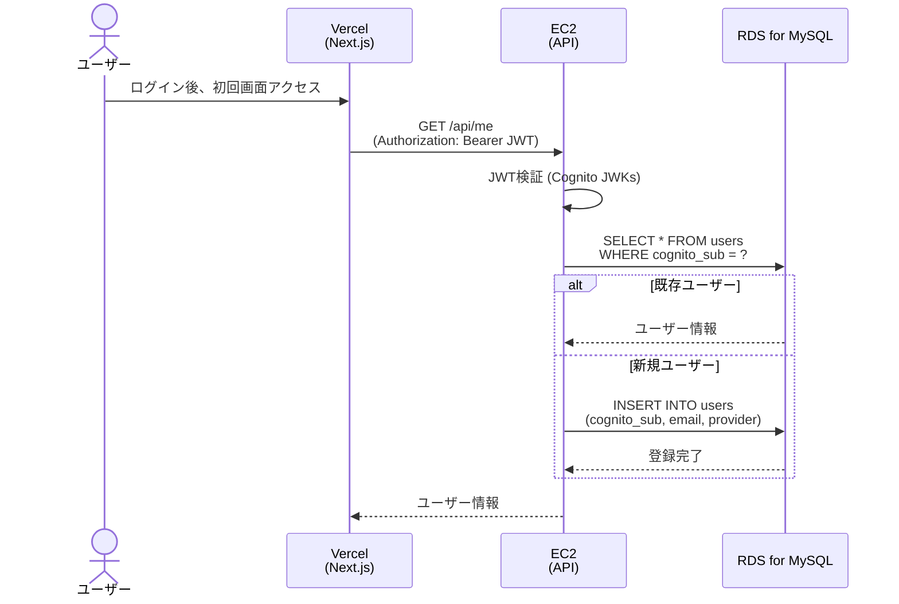
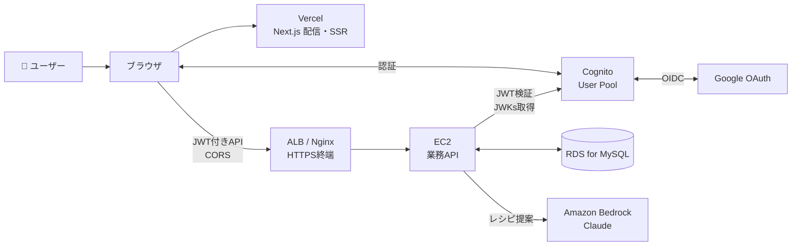
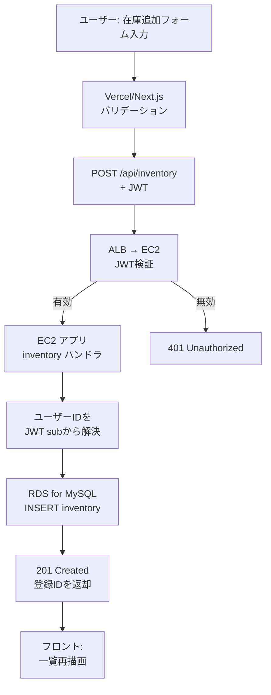
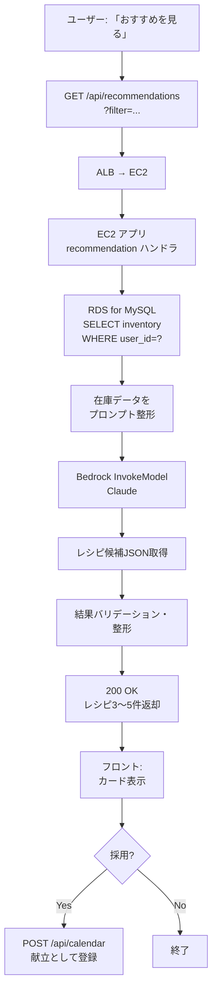
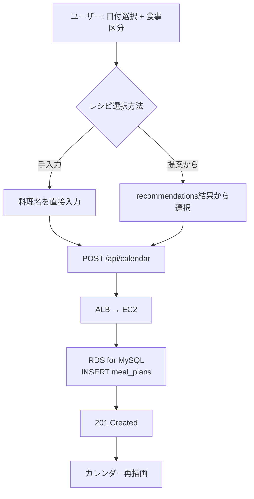
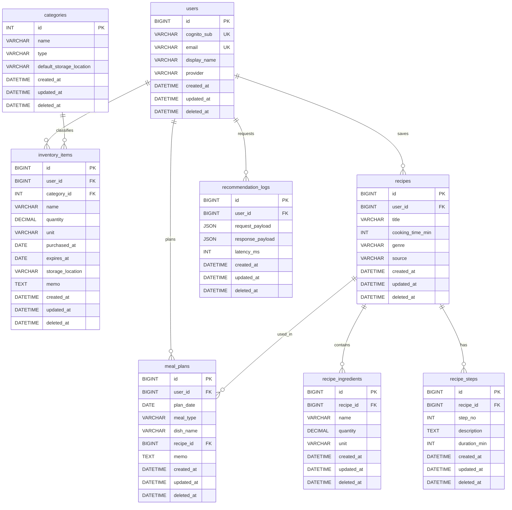

# 認証設計・データフロー・データベース設計書

家庭用 在庫管理・献立支援システム

---

## 1. 認証設計

### 1.1 認証方式の概要

| 項目 | 内容 |
|------|------|
| 認証基盤 | Amazon Cognito User Pool（単独構成） |
| 認証方式 | ① メールアドレス + パスワード ② Google OAuth (OIDC) |
| MFA | TOTP方式（Google Authenticator等）※メール認証経路で必須 |
| トークン形式 | JWT（IDトークン・アクセストークン・リフレッシュトークン） |
| トークン有効期限 | アクセストークン:1時間 / リフレッシュトークン:30日 |
| パスワードポリシー | 8文字以上、英大小文字・数字・記号を含む |

### 1.2 Cognito User Pool 設定

#### User Pool 属性
| 属性 | 種別 | 必須 | 備考 |
|------|------|------|------|
| email | 標準 | ○ | サインインIDとして使用、Verify必須 |
| sub | 標準 | ○ | Cognito発行の一意ID（変更不可） |
| name | 標準 | △ | 表示名 |
| custom:provider | カスタム | ○ | "cognito" or "google" |

#### IDプロバイダ
- **Cognito 自身**：メール+パスワード
- **Google**：OIDC連携（クライアントID/シークレットをCognitoに設定）

#### MFA設定
- 経路ごとの方針：
  - Cognitoネイティブ（メール+パスワード）：**MFA必須**（TOTP）
  - Google経由：MFAはGoogle側に委譲（Cognito側では追加要求しない）

### 1.3 サインアップフロー（メール認証）



### 1.4 ログインフロー（メール認証 + MFA）



### 1.5 ログインフロー（Google認証）



### 1.6 ユーザープロビジョニング（JIT方式）

EC2バックエンド構成では、Cognitoの Post Confirmation Lambda Trigger に依存せず、**初回API呼び出し時にEC2上のアプリケーションで `users` レコードを作成する** JIT (Just-In-Time) 方式を採用する。Lambda Trigger を別途用意しなくて済むためシンプル。



### 1.7 トークン検証ロジック（API側）

EC2上のバックエンドアプリケーションで、リクエストごとにJWTを検証する。

| 項目 | 内容 |
|------|------|
| 検証対象 | IDトークン（Authorization ヘッダの Bearer トークン） |
| 検証ライブラリ例 | Node.js: `aws-jwt-verify` / Python: `python-jose` |
| 検証内容 | 署名（Cognito JWKs）、issuer、audience(client_id)、exp |
| JWKs キャッシュ | 起動時 or 初回検証時に取得し、メモリにキャッシュ（数時間） |
| ユーザー識別 | クレーム `sub` で `users.cognito_sub` を突合 |
| 検証失敗時 | 401 Unauthorized を返却 |

### 1.8 セキュリティ対策

| 観点 | 対策 |
|------|------|
| ブルートフォース | Cognito標準のロックアウト（5回失敗で一時ロック） |
| トークン漏洩 | アクセストークン短命化（1h）、リフレッシュトークンはHttpOnly Cookieに格納 |
| CSRF | SameSite=Strict Cookie、stateパラメータ検証 |
| XSS | CSP設定、入力値サニタイズ |
| 通信 | HTTPS必須（TLS 1.2以上） |

---

## 2. データフロー図

### 2.1 システム全体構成（コンテキスト図）



### 2.2 在庫登録のデータフロー



### 2.3 LLMレシピ提案のデータフロー



### 2.4 カレンダー（献立）登録のデータフロー



---

## 3. データベース設計（Amazon RDS for MySQL 8.0 想定）

### 3.1 ER図



### 3.2 テーブル定義

#### 3.2.1 users（ユーザー）
Cognito の `sub` を外部キー的に保持し、業務データはこのテーブルの `id` で紐付ける。

| カラム | 型 | 制約 | 説明 |
|--------|-----|------|------|
| id | BIGINT | PK, AUTO_INCREMENT | 内部ID |
| cognito_sub | VARCHAR(64) | UNIQUE, NOT NULL | Cognito発行のsub |
| email | VARCHAR(255) | UNIQUE, NOT NULL | メールアドレス |
| display_name | VARCHAR(100) | NULL | 表示名 |
| provider | VARCHAR(20) | NOT NULL | 'cognito' or 'google' |
| created_at | DATETIME | NOT NULL | 作成日時 |
| updated_at | DATETIME | NOT NULL | 更新日時 |
| deleted_at | DATETIME | NULL | 論理削除日時（NULL=有効） |

インデックス: `idx_cognito_sub`, `idx_email`, `idx_deleted_at`

#### 3.2.2 categories（カテゴリマスタ）

| カラム | 型 | 制約 | 説明 |
|--------|-----|------|------|
| id | INT | PK, AUTO_INCREMENT | カテゴリID |
| name | VARCHAR(50) | NOT NULL | 名称（野菜・調味料等） |
| type | VARCHAR(20) | NOT NULL | 'food' / 'seasoning' / 'daily' |
| default_storage_location | VARCHAR(20) | NULL | 当該カテゴリのデフォルト保管場所(`fridge`/`freezer`/`pantry`/NULL)。S-203 在庫追加時の自動推測に使用 |
| created_at | DATETIME | NOT NULL | |
| updated_at | DATETIME | NOT NULL | |
| deleted_at | DATETIME | NULL | 論理削除日時（NULL=有効） |

初期データ：

| name | type | default_storage_location |
|------|------|-------------------------|
| 野菜 | food | fridge |
| 肉 | food | fridge |
| 魚 | food | fridge |
| 乳製品 | food | fridge |
| 冷凍食品 | food | freezer |
| アイス | food | freezer |
| 調味料 | seasoning | pantry |
| 米・麺 | food | pantry |
| 乾物 | food | pantry |
| 日用品 | daily | pantry |

#### 3.2.3 inventory_items（在庫）

| カラム | 型 | 制約 | 説明 |
|--------|-----|------|------|
| id | BIGINT | PK, AUTO_INCREMENT | 在庫ID |
| user_id | BIGINT | FK(users.id), NOT NULL | 所有者 |
| category_id | INT | FK(categories.id), NULL | カテゴリ。**NULL = 未分類**(S-203でカテゴリ未選択時の扱い) |
| name | VARCHAR(100) | NOT NULL | 商品名 |
| quantity | DECIMAL(10,2) | NOT NULL | 数量 |
| unit | VARCHAR(20) | NOT NULL | 単位（個・g・ml） |
| purchased_at | DATE | NULL | 購入日 |
| expires_at | DATE | NULL | 賞味/消費期限 |
| storage_location | VARCHAR(20) | NULL | 'fridge'/'freezer'/'pantry' |
| memo | TEXT | NULL | メモ |
| created_at | DATETIME | NOT NULL | |
| updated_at | DATETIME | NOT NULL | |
| deleted_at | DATETIME | NULL | 論理削除日時（NULL=有効） |

インデックス: `idx_user_id`, `idx_user_expires (user_id, expires_at)`, `idx_deleted_at`

#### 3.2.4 recipes（レシピ）
LLM提案を保存する／ユーザーが手動登録する両方を許容。手順は `recipe_steps` で別管理。

| カラム | 型 | 制約 | 説明 |
|--------|-----|------|------|
| id | BIGINT | PK, AUTO_INCREMENT | レシピID |
| user_id | BIGINT | FK(users.id), NOT NULL | 所有者 |
| title | VARCHAR(200) | NOT NULL | 料理名 |
| cooking_time_min | INT | NULL | 所要時間（分・全体） |
| genre | VARCHAR(20) | NULL | 'japanese'/'western'/'chinese' |
| source | VARCHAR(20) | NOT NULL | 'manual'/'llm' |
| created_at | DATETIME | NOT NULL | |
| updated_at | DATETIME | NOT NULL | |
| deleted_at | DATETIME | NULL | 論理削除日時（NULL=有効） |

#### 3.2.5 recipe_ingredients（レシピ材料）

| カラム | 型 | 制約 | 説明 |
|--------|-----|------|------|
| id | BIGINT | PK, AUTO_INCREMENT | |
| recipe_id | BIGINT | FK(recipes.id), NOT NULL | 親レシピ |
| name | VARCHAR(100) | NOT NULL | 材料名 |
| quantity | DECIMAL(10,2) | NULL | 必要量 |
| unit | VARCHAR(20) | NULL | 単位 |
| created_at | DATETIME | NOT NULL | |
| updated_at | DATETIME | NOT NULL | |
| deleted_at | DATETIME | NULL | 論理削除日時（NULL=有効） |

#### 3.2.6 recipe_steps（レシピ手順）
レシピの調理手順をステップ単位で保持する。`step_no` の昇順に表示する。

| カラム | 型 | 制約 | 説明 |
|--------|-----|------|------|
| id | BIGINT | PK, AUTO_INCREMENT | |
| recipe_id | BIGINT | FK(recipes.id), NOT NULL | 親レシピ |
| step_no | INT | NOT NULL | 手順番号（1始まり） |
| description | TEXT | NOT NULL | 手順テキスト |
| duration_min | INT | NULL | 当該ステップの所要時間（分） |
| created_at | DATETIME | NOT NULL | |
| updated_at | DATETIME | NOT NULL | |
| deleted_at | DATETIME | NULL | 論理削除日時（NULL=有効） |

インデックス: `uk_recipe_step (recipe_id, step_no, deleted_at)` ※論理削除を考慮し `deleted_at` を含めて一意

#### 3.2.7 meal_plans（献立カレンダー）

| カラム | 型 | 制約 | 説明 |
|--------|-----|------|------|
| id | BIGINT | PK, AUTO_INCREMENT | 献立ID |
| user_id | BIGINT | FK(users.id), NOT NULL | 所有者 |
| plan_date | DATE | NOT NULL | 日付 |
| meal_type | VARCHAR(20) | NOT NULL | 'breakfast'/'lunch'/'dinner'/'snack' |
| dish_name | VARCHAR(200) | NOT NULL | 料理名 |
| recipe_id | BIGINT | FK(recipes.id), NULL | レシピ紐付け（任意） |
| memo | TEXT | NULL | メモ |
| created_at | DATETIME | NOT NULL | |
| updated_at | DATETIME | NOT NULL | |
| deleted_at | DATETIME | NULL | 論理削除日時（NULL=有効） |

インデックス: `idx_user_date (user_id, plan_date)`, `idx_deleted_at`

#### 3.2.8 recommendation_logs（提案履歴）
LLM提案のログ。コスト分析・チューニング用。

| カラム | 型 | 制約 | 説明 |
|--------|-----|------|------|
| id | BIGINT | PK, AUTO_INCREMENT | |
| user_id | BIGINT | FK(users.id), NOT NULL | |
| request_payload | JSON | NOT NULL | 在庫スナップショット・条件 |
| response_payload | JSON | NOT NULL | LLM応答（整形後） |
| latency_ms | INT | NULL | 応答時間 |
| created_at | DATETIME | NOT NULL | |
| updated_at | DATETIME | NOT NULL | |
| deleted_at | DATETIME | NULL | 論理削除日時（NULL=有効） |

### 3.3 DDL（抜粋）

```sql
CREATE TABLE users (
  id BIGINT NOT NULL AUTO_INCREMENT,
  cognito_sub VARCHAR(64) NOT NULL,
  email VARCHAR(255) NOT NULL,
  display_name VARCHAR(100),
  provider VARCHAR(20) NOT NULL,
  created_at DATETIME NOT NULL DEFAULT CURRENT_TIMESTAMP,
  updated_at DATETIME NOT NULL DEFAULT CURRENT_TIMESTAMP ON UPDATE CURRENT_TIMESTAMP,
  deleted_at DATETIME DEFAULT NULL,
  PRIMARY KEY (id),
  UNIQUE KEY uk_cognito_sub (cognito_sub),
  UNIQUE KEY uk_email (email),
  KEY idx_deleted_at (deleted_at)
) ENGINE=InnoDB DEFAULT CHARSET=utf8mb4;

CREATE TABLE categories (
  id INT NOT NULL AUTO_INCREMENT,
  name VARCHAR(50) NOT NULL,
  type VARCHAR(20) NOT NULL,
  default_storage_location VARCHAR(20) DEFAULT NULL,
  created_at DATETIME NOT NULL DEFAULT CURRENT_TIMESTAMP,
  updated_at DATETIME NOT NULL DEFAULT CURRENT_TIMESTAMP ON UPDATE CURRENT_TIMESTAMP,
  deleted_at DATETIME DEFAULT NULL,
  PRIMARY KEY (id),
  KEY idx_deleted_at (deleted_at)
) ENGINE=InnoDB DEFAULT CHARSET=utf8mb4;

CREATE TABLE inventory_items (
  id BIGINT NOT NULL AUTO_INCREMENT,
  user_id BIGINT NOT NULL,
  category_id INT,
  name VARCHAR(100) NOT NULL,
  quantity DECIMAL(10,2) NOT NULL,
  unit VARCHAR(20) NOT NULL,
  purchased_at DATE,
  expires_at DATE,
  storage_location VARCHAR(20),
  memo TEXT,
  created_at DATETIME NOT NULL DEFAULT CURRENT_TIMESTAMP,
  updated_at DATETIME NOT NULL DEFAULT CURRENT_TIMESTAMP ON UPDATE CURRENT_TIMESTAMP,
  deleted_at DATETIME DEFAULT NULL,
  PRIMARY KEY (id),
  KEY idx_user_id (user_id),
  KEY idx_user_expires (user_id, expires_at),
  KEY idx_deleted_at (deleted_at),
  CONSTRAINT fk_inv_user FOREIGN KEY (user_id) REFERENCES users(id) ON DELETE CASCADE,
  CONSTRAINT fk_inv_cat FOREIGN KEY (category_id) REFERENCES categories(id)
) ENGINE=InnoDB DEFAULT CHARSET=utf8mb4;

CREATE TABLE recipes (
  id BIGINT NOT NULL AUTO_INCREMENT,
  user_id BIGINT NOT NULL,
  title VARCHAR(200) NOT NULL,
  cooking_time_min INT,
  genre VARCHAR(20),
  source VARCHAR(20) NOT NULL,
  created_at DATETIME NOT NULL DEFAULT CURRENT_TIMESTAMP,
  updated_at DATETIME NOT NULL DEFAULT CURRENT_TIMESTAMP ON UPDATE CURRENT_TIMESTAMP,
  deleted_at DATETIME DEFAULT NULL,
  PRIMARY KEY (id),
  KEY idx_user_id (user_id),
  KEY idx_deleted_at (deleted_at),
  CONSTRAINT fk_recipe_user FOREIGN KEY (user_id) REFERENCES users(id) ON DELETE CASCADE
) ENGINE=InnoDB DEFAULT CHARSET=utf8mb4;

CREATE TABLE recipe_ingredients (
  id BIGINT NOT NULL AUTO_INCREMENT,
  recipe_id BIGINT NOT NULL,
  name VARCHAR(100) NOT NULL,
  quantity DECIMAL(10,2),
  unit VARCHAR(20),
  created_at DATETIME NOT NULL DEFAULT CURRENT_TIMESTAMP,
  updated_at DATETIME NOT NULL DEFAULT CURRENT_TIMESTAMP ON UPDATE CURRENT_TIMESTAMP,
  deleted_at DATETIME DEFAULT NULL,
  PRIMARY KEY (id),
  KEY idx_recipe_id (recipe_id),
  CONSTRAINT fk_ing_recipe FOREIGN KEY (recipe_id) REFERENCES recipes(id) ON DELETE CASCADE
) ENGINE=InnoDB DEFAULT CHARSET=utf8mb4;

CREATE TABLE recipe_steps (
  id BIGINT NOT NULL AUTO_INCREMENT,
  recipe_id BIGINT NOT NULL,
  step_no INT NOT NULL,
  description TEXT NOT NULL,
  duration_min INT,
  created_at DATETIME NOT NULL DEFAULT CURRENT_TIMESTAMP,
  updated_at DATETIME NOT NULL DEFAULT CURRENT_TIMESTAMP ON UPDATE CURRENT_TIMESTAMP,
  deleted_at DATETIME DEFAULT NULL,
  PRIMARY KEY (id),
  UNIQUE KEY uk_recipe_step (recipe_id, step_no, deleted_at),
  CONSTRAINT fk_step_recipe FOREIGN KEY (recipe_id) REFERENCES recipes(id) ON DELETE CASCADE
) ENGINE=InnoDB DEFAULT CHARSET=utf8mb4;

CREATE TABLE meal_plans (
  id BIGINT NOT NULL AUTO_INCREMENT,
  user_id BIGINT NOT NULL,
  plan_date DATE NOT NULL,
  meal_type VARCHAR(20) NOT NULL,
  dish_name VARCHAR(200) NOT NULL,
  recipe_id BIGINT,
  memo TEXT,
  created_at DATETIME NOT NULL DEFAULT CURRENT_TIMESTAMP,
  updated_at DATETIME NOT NULL DEFAULT CURRENT_TIMESTAMP ON UPDATE CURRENT_TIMESTAMP,
  deleted_at DATETIME DEFAULT NULL,
  PRIMARY KEY (id),
  KEY idx_user_date (user_id, plan_date),
  KEY idx_deleted_at (deleted_at),
  CONSTRAINT fk_mp_user FOREIGN KEY (user_id) REFERENCES users(id) ON DELETE CASCADE,
  CONSTRAINT fk_mp_recipe FOREIGN KEY (recipe_id) REFERENCES recipes(id) ON DELETE SET NULL
) ENGINE=InnoDB DEFAULT CHARSET=utf8mb4;

CREATE TABLE recommendation_logs (
  id BIGINT NOT NULL AUTO_INCREMENT,
  user_id BIGINT NOT NULL,
  request_payload JSON NOT NULL,
  response_payload JSON NOT NULL,
  latency_ms INT,
  created_at DATETIME NOT NULL DEFAULT CURRENT_TIMESTAMP,
  updated_at DATETIME NOT NULL DEFAULT CURRENT_TIMESTAMP ON UPDATE CURRENT_TIMESTAMP,
  deleted_at DATETIME DEFAULT NULL,
  PRIMARY KEY (id),
  KEY idx_user_created (user_id, created_at),
  CONSTRAINT fk_log_user FOREIGN KEY (user_id) REFERENCES users(id) ON DELETE CASCADE
) ENGINE=InnoDB DEFAULT CHARSET=utf8mb4;
```

### 3.4 論理削除の運用ルール

| 項目 | ルール |
|------|--------|
| 削除操作 | DELETE文ではなく `UPDATE ... SET deleted_at = NOW()` を発行 |
| 参照クエリ | 必ず `WHERE deleted_at IS NULL` を付与（ORM側のグローバルスコープ推奨） |
| ユニーク制約 | `deleted_at` を含めて一意性を担保（例：`recipe_steps`） |
| 子テーブルの連動 | 親を論理削除した際、子も同時に論理削除（アプリ側で実施） |
| 物理削除 | 行わない。必要に応じバッチで一定期間経過後にパージ（将来検討） |
| 復元 | `deleted_at = NULL` に戻すことで可能 |

### 3.5 設計上の判断ポイント

| 論点 | 判断 | 理由 |
|------|------|------|
| Cognito sub をPKにするか | しない（内部IDを別途持つ） | プロバイダ移行や再発行への耐性 |
| レシピを共通マスタにするか | 当面 user_id 紐付け | 個人利用想定。共有機能は将来スコープ |
| 在庫履歴の保持 | 当面は持たない | スコープ外。必要なら `inventory_history` を追加 |
| 論理削除 | **全テーブルで採用** | `deleted_at` で誤削除復元・監査性を担保 |
| カテゴリのマスタ化 | 共通マスタ化 | 提案精度のため命名揺れを抑える |
| recommendation_logs の論理削除 | 揃えて採用 | 全テーブル統一ルールを優先 |
| 「未分類」をマスタ化するか | しない(`category_id IS NULL`で表現) | マスタにダミーレコードを増やさない、フロントで「未分類」ラベル表示 |
| カテゴリのデフォルト保管場所 | `default_storage_location` カラムを持つ | S-203 在庫追加時の入力負荷削減 |

---

## 4. 改訂履歴

| 版数 | 日付 | 内容 |
|------|------|------|
| 1.0 | 2026-05-06 | 初版作成（認証設計・データフロー・DB設計） |
| 1.1 | 2026-05-06 | レシピ手順を `recipe_steps` テーブルへ正規化 |
| 1.2 | 2026-05-06 | 全テーブルに `deleted_at` を追加し論理削除方針に変更 |
| 1.3 | 2026-05-06 | バックエンド構成を Vercel + EC2 + RDS for MySQL に変更（API Gateway+Lambda廃止）、Post Confirmation Lambda Trigger を JIT プロビジョニング方式に変更 |
| 1.4 | 2026-05-08 | 画面詳細設計(S-201/S-203/S-101)からのギャップを反映: <br>・ `categories.default_storage_location` カラム追加 <br>・ `inventory_items.category_id` を NULL 許容(=未分類)として明文化 <br>・ カテゴリマスタ初期データに保管場所デフォルトを追加 |