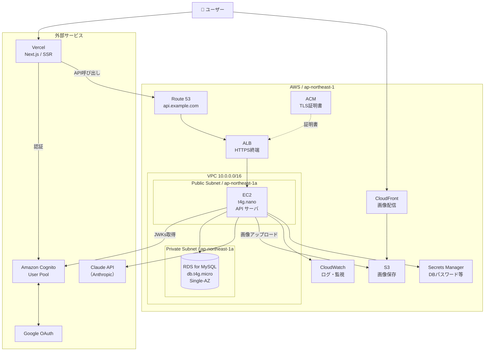

# インフラ設計書

家庭用 在庫管理・献立支援システム

設計方針：**コスト優先・最小限構成**（シングルAZ、スケーリングなし）

---

## 1. 全体構成

### 1.1 構成図



### 1.2 リージョン
- **ap-northeast-1（東京）**：レイテンシ最小化のため

### 1.3 AWSアカウント構成
- 本番アカウント1つで運用
- IAMでアクセス制御
- 個人開発のため Organizations は使用しない

---

## 2. ネットワーク設計

### 2.1 VPC構成

| 項目 | 値 |
|------|-----|
| VPC CIDR | `10.0.0.0/16` |
| AZ | `ap-northeast-1a`（シングルAZ） |
| Public Subnet | `10.0.1.0/24` |
| Private Subnet | `10.0.11.0/24` |

### 2.2 サブネット用途

| サブネット | 用途 | 配置リソース |
|-----------|------|-------------|
| Public | インターネット直接通信が必要なリソース | ALB, EC2 |
| Private | 外部からの直接アクセス不可 | RDS |

> **注意**：通常はEC2もPrivate Subnetに置きNAT Gatewayで外向き通信させますが、NAT Gatewayは月額$32かかるため、**コスト優先のためEC2をPublic Subnetに配置**し、セキュリティグループで保護する構成とする。

### 2.3 Internet Gateway / NAT Gateway

| 項目 | 採用 | 理由 |
|------|------|------|
| Internet Gateway | ○ | EC2が外部API（Cognito JWKs、Claude API）を呼ぶため必須 |
| NAT Gateway | × | コスト削減のため不採用。EC2はPublic Subnetに配置 |
| VPC Endpoint | × | コスト削減のため不採用。S3もインターネット経由で接続 |

### 2.4 ルートテーブル

#### Public Route Table
| 宛先 | ターゲット |
|------|-----------|
| `10.0.0.0/16` | local |
| `0.0.0.0/0` | Internet Gateway |

#### Private Route Table
| 宛先 | ターゲット |
|------|-----------|
| `10.0.0.0/16` | local |

外向き通信なし（RDSはVPC内通信のみ）。

---

## 3. セキュリティ設計

### 3.1 セキュリティグループ

#### sg-alb（ALB用）
| 方向 | プロトコル | ポート | ソース/宛先 | 用途 |
|------|-----------|--------|------------|------|
| Inbound | TCP | 443 | `0.0.0.0/0` | HTTPS受信 |
| Inbound | TCP | 80 | `0.0.0.0/0` | HTTP→HTTPSリダイレクト用 |
| Outbound | TCP | 全て | `sg-ec2` | EC2へ転送 |

#### sg-ec2（EC2用）
| 方向 | プロトコル | ポート | ソース/宛先 | 用途 |
|------|-----------|--------|------------|------|
| Inbound | TCP | 8080 | `sg-alb` | ALBからのアプリ受信 |
| Inbound | TCP | 22 | 自IP/32 | SSH（運用時のみ、Session Manager推奨） |
| Outbound | TCP | 443 | `0.0.0.0/0` | Cognito/Claude API/S3呼び出し |
| Outbound | TCP | 3306 | `sg-rds` | RDSへ接続 |

#### sg-rds（RDS用）
| 方向 | プロトコル | ポート | ソース/宛先 | 用途 |
|------|-----------|--------|------------|------|
| Inbound | TCP | 3306 | `sg-ec2` | EC2からのみ受信 |
| Outbound | （なし） | - | - | - |

### 3.2 IAM設計

#### EC2インスタンスロール
EC2がAWSサービスにアクセスするためのIAMロール。**アクセスキー埋め込み禁止**。

| ポリシー | 用途 |
|---------|------|
| `AmazonSSMManagedInstanceCore` | Session Manager接続 |
| `CloudWatchAgentServerPolicy` | CloudWatch Logs/メトリクス送信 |
| `S3AppBucketAccess`（カスタム） | アプリ用S3バケットへのRW |
| `SecretsManagerReadOnly`（カスタム） | DB認証情報・APIキーの取得 |

> **注意**：Bedrock IAMロールは不要。Claude APIキー（`ANTHROPIC_API_KEY`）は Secrets Manager で管理し、アプリ起動時に取得する。

### 3.3 SSH/運用アクセス
- **SSH直接接続は原則禁止**
- AWS Systems Manager Session Manager 経由でアクセス
- Session Manager は IAM 認証 + 通信暗号化、ポート開放不要

### 3.4 Secrets Manager
以下を Secrets Manager で管理：

| シークレット名 | 内容 |
|---------------|------|
| `prod/db/credentials` | RDSのユーザー名・パスワード |
| `prod/cognito/client-secret` | Cognito クライアントシークレット |
| `prod/google/oauth` | Google OAuth クライアントID/シークレット |
| `prod/anthropic/api-key` | Anthropic APIキー |

EC2は起動時にIAMロール経由で取得。

---

## 4. 各リソースの詳細

### 4.1 Vercel（フロントエンド）

| 項目 | 設定 |
|------|------|
| プラン | Hobby（無料） |
| ランタイム | Next.js 14+ |
| ビルド | GitHub連携で自動デプロイ |
| ドメイン | `app.example.com`（カスタムドメイン）／プレビューは `*.vercel.app` |
| 環境変数 | Cognito User Pool ID、Client ID、API ベースURL等 |

### 4.2 Route 53

| 項目 | 設定 |
|------|------|
| ホストゾーン | `example.com` |
| レコード | `api.example.com` → ALB（Aliasレコード） |
| レコード | `app.example.com` → Vercel（CNAMEまたはA） |

### 4.3 ACM（証明書）

| 項目 | 設定 |
|------|------|
| 証明書 | `*.example.com`（ワイルドカード） |
| 検証方法 | DNS検証（自動更新可能） |
| リージョン | ap-northeast-1（ALB用） |
| コスト | 無料 |

### 4.4 ALB

| 項目 | 設定 |
|------|------|
| スキーム | internet-facing |
| サブネット | Public Subnet（シングルAZ運用：但しALB自体は最低2AZ必要なため、ダミーで別AZのpublic subnetもVPCに作成し関連付け） |
| リスナー | HTTPS:443 → EC2:8080 / HTTP:80 → HTTPS:443 リダイレクト |
| ターゲットグループ | EC2 1台、ヘルスチェック `GET /api/health` |
| ヘルスチェック間隔 | 30秒 |

> **補足**：ALB はマルチAZ前提のサービスのため、サブネットを2AZ以上指定する必要がある。ただし EC2 ターゲットは1AZのみに登録するため、実質シングルAZ運用となる。

### 4.5 EC2

| 項目 | 設定 |
|------|------|
| インスタンスタイプ | `t4g.nano`（ARM Graviton2、2 vCPU、0.5GB RAM） |
| AMI | Amazon Linux 2023 (ARM64) |
| ストレージ | EBS gp3 8GB |
| サブネット | Public Subnet (`10.0.1.0/24`) |
| Elastic IP | 1個割り当て（インスタンス停止時の再起動でIP変動を防ぐ） |
| 自動起動 | 起動しっぱなし（24/365） |
| バックアップ | 任意（重要データはRDS側、EC2はimmutable運用想定） |

#### 起動時セットアップ（cloud-init / user-data）
1. Node.js（or Python）ランタイム導入
2. CloudWatch Agent 導入
3. アプリケーションを git clone（or S3から取得）
4. Secrets Manager から DB認証情報取得
5. systemdでアプリを常駐起動

### 4.6 RDS for MySQL

| 項目 | 設定 |
|------|------|
| エンジン | MySQL 8.0 |
| インスタンスタイプ | `db.t4g.micro`（ARM、2 vCPU、1GB RAM） |
| ストレージ | gp3 20GB（自動拡張：上限100GB） |
| Multi-AZ | **無効**（コスト優先） |
| サブネット | Private Subnet（`10.0.11.0/24` + 別AZのprivate subnet：DB Subnet Group要件） |
| パブリックアクセス | 無効 |
| 自動バックアップ | 7日間保持 |
| メンテナンスウィンドウ | 日曜 03:00-04:00 JST |
| パラメータグループ | `default.mysql8.0` ベース |
| 暗号化 | KMSで保管時暗号化 |

> **補足**：RDSもDB Subnet Groupで2AZ以上のsubnet指定が必要。ただしSingle-AZ構成なら実体は1AZのみで稼働する。

### 4.7 S3

| 項目 | 設定 |
|------|------|
| バケット名 | `app-prod-assets-{account_id}` |
| リージョン | ap-northeast-1 |
| バージョニング | 無効（コスト優先） |
| 暗号化 | SSE-S3（デフォルト） |
| パブリックアクセス | 一部公開（CloudFront経由用パスのみ） |
| ブロックパブリックアクセス | OACでCloudFrontからのみ許可 |
| ライフサイクル | 不要（画像が増えてきたら設定検討） |

#### バケットポリシー方針
- **アップロード**：EC2のIAMロールからのみPUT可能
- **読み取り**：CloudFront OAC（Origin Access Control）経由のGETのみ許可
- **直接アクセス**：S3のURLでは閲覧不可（CloudFront経由必須）

### 4.8 CloudFront

| 項目 | 設定 |
|------|------|
| ディストリビューション | 1個 |
| オリジン | S3 バケット（OAC経由） |
| ビヘイビア | デフォルト：CachingOptimized、TTL 24時間 |
| カスタムドメイン | `cdn.example.com`（任意） |
| 証明書 | ACM（**us-east-1リージョン**で発行が必要） |
| 圧縮 | 自動圧縮 有効 |

### 4.9 Cognito User Pool

| 項目 | 設定 |
|------|------|
| プールタイプ | User Pool（Identity Poolなし） |
| サインイン | email |
| MFA | **初期実装では無効**（非アクティブ）／将来 TOTP必須（メール認証経路）、Google経由は委譲 |
| パスワードポリシー | 8文字以上、英大小・数字・記号 |
| トリガー | なし（JIT方式のためPost Confirmation Lambda不要） |
| ドメイン | Cognito Hosted UI: `auth.example.com`（カスタム） |
| アプリクライアント | 1個（Vercelフロントエンド用） |
| IDプロバイダ | Cognito + Google |

### 4.10 CloudWatch

| 項目 | 設定 |
|------|------|
| ロググループ | `/app/api`（EC2アプリログ）、`/aws/rds/...`（RDSログ） |
| ログ保持期間 | 30日 |
| メトリクス | EC2 CPU/メモリ、RDS接続数、ALB 5xx率 |
| アラーム | EC2 CPU > 80%、RDS接続枯渇、ALB 5xx率 > 5% |
| 通知先 | SNS → メール |

### 4.11 Claude API（Anthropic）

| 項目 | 設定 |
|------|------|
| モデル | `claude-sonnet-4-6`（環境変数 `ANTHROPIC_MODEL` で変更可） |
| アクセス方法 | Anthropic APIキー（`ANTHROPIC_API_KEY`）による直接呼び出し |
| エンドポイント | `https://api.anthropic.com/v1/messages` |
| APIキー管理 | Secrets Manager `prod/anthropic/api-key` に格納し、起動時に取得 |
| 利用ガードレール | `max_tokens` で出力サイズを制限 |

---

## 5. デプロイ・運用

### 5.1 CI/CD

| 対象 | 方法 |
|------|------|
| フロント（Vercel） | GitHub `main` push → Vercel自動デプロイ |
| バックエンド（EC2） | GitHub Actions → SSM Run Command でEC2上のスクリプト実行（git pull + systemctl restart） |
| インフラ（IaC） | Terraform、`terraform apply` を手動実行（個人開発のため自動化は最小限） |

### 5.2 ログ・監視
- CloudWatch Logs に集約
- アプリログは構造化JSON（リクエストID、ユーザーID、レイテンシ等）
- アラームはSNS → 個人メールに通知

### 5.3 バックアップ・DR

| 対象 | 戦略 |
|------|------|
| RDS | 自動バックアップ7日 + 手動スナップショット（重要操作前） |
| S3 | バージョニング無効（コスト優先）。重要データなら別バケットに定期コピー |
| EC2 | Immutable運用（コードはGit、設定はTerraform/cloud-initで再現可能） |
| Cognito | エクスポート機能で定期バックアップ（任意） |

シングルAZ構成のため、AZ障害時の復旧時間は数時間〜半日想定。**個人利用前提でこのリスクを許容する**。

### 5.4 コスト最適化TIPS
- EC2は **Compute Savings Plans** で1年契約すれば約30%割引
- RDSは **Reserved Instance** 1年契約で約30%割引
- S3 / CloudFront / Claude API は従量課金（使用分のみ）
- 開発環境は使用時のみ起動してコスト圧縮

---

## 6. 月額コスト試算（東京リージョン目安）

| サービス | 構成 | 月額 |
|---------|------|------|
| Vercel | Hobby | $0 |
| Route 53 | ホストゾーン1個 + クエリ少量 | $0.5 |
| ACM | 証明書 | $0 |
| ALB | 最小利用 | $20 |
| EC2 | t4g.nano (ARM)、Elastic IP含む | $4 |
| EBS | gp3 8GB | $1 |
| RDS for MySQL | db.t4g.micro Single-AZ + gp3 20GB | $18 |
| RDS自動バックアップ | 7日分 | $1〜2 |
| S3 | 数GB保存 + 少量リクエスト | $1 |
| CloudFront | 数GB配信 | $1 |
| Cognito | MAU < 50 | $0 |
| Claude API (Anthropic) | 月数十回〜数百回呼び出し | $1〜10 |
| CloudWatch | ログ数GB + 基本メトリクス | $2 |
| Secrets Manager | 3シークレット | $1.5 |
| データ転送 | EC2 OUT 数GB等 | $1〜3 |
| **合計** | | **約 $50〜65/月** |

### コスト削減オプション（必要に応じて）

| 削減策 | 削減額 | トレードオフ |
|-------|--------|-------------|
| ALB廃止しEC2でCaddy受け | -$20 | 証明書管理が手動寄り、運用負荷増 |
| EC2 1年契約（Savings Plans） | -$1〜2 | 1年コミット |
| RDS 1年契約（RI） | -$5 | 1年コミット |
| CloudFront廃止しS3直接配信 | -$1 | 高速配信不可 |

最小構成（ALB廃止 + 予約購入）で **約 $40〜45/月** まで圧縮可能。

---

## 7. セキュリティ・コンプライアンス

### 7.1 想定脅威と対策

| 脅威 | 対策 |
|------|------|
| 不正アクセス（Brute Force） | Cognitoのロックアウト + ALB WAF（任意） |
| SQLインジェクション | アプリ側でprepared statement徹底 |
| XSS | フロントでCSP設定、入力サニタイズ |
| CSRF | SameSite Cookie、stateパラメータ検証 |
| データ漏洩 | RDS暗号化、S3暗号化、Secrets Manager使用 |
| DDoS | ALB前段で軽い緩和、本格対策はShield Advanced（高額のため不採用） |

### 7.2 個人情報保護
- メールアドレス・表示名のみ保持
- 第三者提供なし
- 利用規約・プライバシーポリシーをアプリで掲示

---

## 8. スケーリング・可用性に関する留意事項

本構成は **個人利用前提のSingle-AZ構成**。以下のリスクを許容：

| リスク | 影響 | 許容理由 |
|-------|------|---------|
| AZ障害 | 数時間〜半日の停止 | 個人利用なので許容 |
| EC2インスタンス障害 | 単一障害点。手動再起動が必要 | 起動しっぱなし運用、障害頻度は低い |
| トラフィック急増 | スループット限界に達する可能性 | 個人利用なので想定外 |

将来必要になった場合の拡張パス：
1. RDS Multi-AZ化（+$18/月）
2. EC2 Auto Scaling Group化（最低2台で +$4〜8/月）
3. ALB を活かしたBlue/Greenデプロイ
4. ElastiCacheの導入（セッション・キャッシュ）

---

## 9. Terraform 構成（参考）

### 9.1 ディレクトリ構成案
```
terraform/
├── envs/
│   ├── prod/
│   │   ├── main.tf
│   │   ├── variables.tf
│   │   └── terraform.tfvars
│   └── stg/
└── modules/
    ├── network/   # VPC, Subnet, IGW, RT, SG
    ├── compute/   # EC2, ALB, ACM
    ├── database/  # RDS, Subnet Group
    ├── storage/   # S3, CloudFront
    ├── auth/      # Cognito User Pool
    └── observability/ # CloudWatch
```

### 9.2 状態管理
- Terraform state は S3 + DynamoDB（state locking）
- 個人開発なら state を S3 のみでも可（lock不要）

---

## 10. 改訂履歴

| 版数 | 日付 | 内容 |
|------|------|------|
| 1.0 | 2026-05-08 | 初版作成（Vercel + EC2 + RDS、Single-AZ、最小構成） |