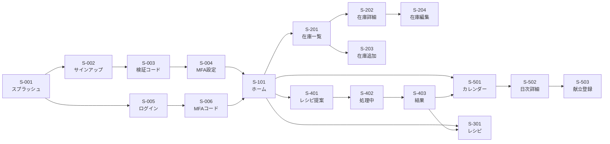

# 画面設計書

家庭用 在庫管理・献立支援システム

設計方針：**Figma連携（パターン1：Figmaが真）／モバイル375pxファースト／レスポンシブで PC対応**

---

## 1. Figma連携の運用方針

### 1.1 役割分担

| 対象 | 管理場所 |
|------|---------|
| ピクセル単位のレイアウト・スタイル | **Figma**（真の情報源） |
| デザイントークン（色・タイポ・スペーシング） | **Figma Variables** |
| コンポーネントライブラリ | **Figma Components** |
| 画面遷移のクリッカブルプロトタイプ | **Figma Prototype** |
| 画面一覧・機能仕様・API連携・状態管理 | **本Markdown（screens.md）** |
| エッジケース・バリデーション・空状態 | **本Markdown** |

### 1.2 Figmaファイル構成

```
📁 Figma File: 家庭用在庫管理アプリ
├── 📄 Cover                    # ファイルの説明
├── 📄 Design Tokens            # 色・フォント・スペーシング・角丸
├── 📄 Components               # ボタン、入力欄、カード、ヘッダー等
├── 📄 01 Auth                  # 認証系画面
├── 📄 02 Inventory             # 在庫管理画面
├── 📄 03 Recipes               # レシピ画面
├── 📄 04 Calendar              # 献立カレンダー画面
├── 📄 05 Recommendations       # LLMレシピ提案画面
├── 📄 06 Settings              # 設定・プロフィール画面
└── 📄 Prototype                # 画面遷移プロトタイプ
```

### 1.3 Figmaリンクの記法

各画面のリンクは以下の形式で記載する：

```
https://www.figma.com/design/{file_key}/{file_name}?node-id={node_id}
```

`node-id` を含めることで、その画面（フレーム）にピンポイントで遷移できる。

> ※本ドキュメントの Figmaリンクは現時点ではプレースホルダー（`{TBD}`）。Figma作成後にURLを差し替える。

### 1.4 デザイントークン（Figma Variables で定義）

#### カラー
| トークン | 用途 | 値（参考） |
|---------|------|-----------|
| `color/primary` | プライマリ（ボタン・アクセント） | `#3B82F6` |
| `color/primary-hover` | プライマリのホバー | `#2563EB` |
| `color/danger` | 削除・エラー | `#EF4444` |
| `color/success` | 成功・期限OK | `#10B981` |
| `color/warning` | 期限間近 | `#F59E0B` |
| `color/text-primary` | 本文 | `#111827` |
| `color/text-secondary` | 補助テキスト | `#6B7280` |
| `color/background` | ページ背景 | `#F9FAFB` |
| `color/surface` | カード背景 | `#FFFFFF` |
| `color/border` | 境界線 | `#E5E7EB` |

#### タイポグラフィ
| トークン | サイズ / 行間 / 太さ | 用途 |
|---------|---------------------|------|
| `text/h1` | 24px / 32px / 700 | 画面タイトル |
| `text/h2` | 20px / 28px / 600 | セクション見出し |
| `text/h3` | 18px / 24px / 600 | カード見出し |
| `text/body` | 16px / 24px / 400 | 本文 |
| `text/caption` | 14px / 20px / 400 | 補助テキスト |
| `text/small` | 12px / 16px / 400 | キャプション |

フォントファミリー：`Inter` / `Noto Sans JP` のフォールバック

#### スペーシング
4の倍数を基準（`4 / 8 / 12 / 16 / 20 / 24 / 32 / 48 / 64`）

#### 角丸
| トークン | 値 | 用途 |
|---------|-----|------|
| `radius/sm` | 4px | バッジ・タグ |
| `radius/md` | 8px | ボタン・入力欄 |
| `radius/lg` | 12px | カード |
| `radius/xl` | 16px | モーダル・大きなカード |

### 1.5 Tailwind CSS との対応

実装時は Tailwind の `tailwind.config.js` でデザイントークンと同一の値を定義し、Figmaと実装の乖離を防ぐ。

---

## 2. 共通レイアウト

### 2.1 画面構造（モバイル）

```
┌─────────────────┐
│   ヘッダー       │ 56px ← AppBar（タイトル・戻る・メニュー）
├─────────────────┤
│                  │
│   メインコンテンツ │ 可変 ← スクロール領域
│                  │
├─────────────────┤
│ 🏠 📦 📅 🍳 ⚙️  │ 64px ← BottomNavigation（5タブ）
├─────────────────┤
│  Safe Area      │ env(safe-area-inset-bottom)
└─────────────────┘
```

幅375px、最大幅は640pxまでにしてPCでも違和感ない表示。

#### 2.1.1 共通レイアウトの寸法

| パーツ | 高さ | 用途・備考 |
|-------|------|-----------|
| ヘッダー（AppBar） | **56px** | 全画面共通。タイトル・戻る・アクションアイコンを配置 |
| BottomNavigation | **64px** | アイコン24px + ラベル12pxが収まる高さ。5タブ等幅 |
| Safe Area（下部） | デバイス依存 | iOSのホームバー領域。`env(safe-area-inset-bottom)` で吸収 |
| ボトム固定フッター（フォーム画面用） | **72px** | プライマリボタン48px + 上下余白12px。S-203/S-303等で使用 |
| FAB（Floating Action Button） | 56×56px | BottomNavigationの上、右下16〜24px余白 |

#### 2.1.2 コンテンツ領域の計算

通常画面（BottomNavigationあり）:
```
コンテンツ高さ = 画面高さ - ヘッダー(56) - BottomNav(64) - SafeArea
```

フォーム画面（BottomNavigation非表示、ボトム固定フッターあり）:
```
コンテンツ高さ = 画面高さ - ヘッダー(56) - フッター(72) - SafeArea
```

スクロール領域内では、スクロール開始位置がヘッダー直下(top: 56px)から始まる。固定要素（ヘッダー・BottomNav・ボトムフッター）はスクロールの影響を受けない。

#### 2.1.3 BottomNavigationを表示する画面 / しない画面

| 画面群 | BottomNavigation |
|--------|-----------------|
| 認証系（S-001〜S-007） | **非表示** |
| メイン画面（S-101 / S-201 / S-301 / S-501 / S-601） | 表示 |
| 詳細画面（S-202 / S-302 / S-502 など） | 表示 |
| フォーム系（S-203 / S-204 / S-303 / S-503 / S-504） | **非表示**（代わりにボトム固定フッターで保存ボタン等を配置） |
| エラー画面（S-701〜S-703） | 文脈による |

#### 2.1.4 横幅と余白

| 項目 | 値 |
|------|-----|
| 画面幅 | 375px基準、最大640pxまでセンタリング |
| 左右の標準余白 | 16px |
| カード間の縦余白 | 8px〜12px |
| セクション間の縦余白 | 24px |

### 2.2 BottomNavigation 構成

| タブ | アイコン | ラベル | 遷移先 |
|------|---------|--------|--------|
| 1 | home | ホーム | `/home` |
| 2 | package | 在庫 | `/inventory` |
| 3 | calendar | 献立 | `/calendar` |
| 4 | chef-hat | レシピ | `/recipes` |
| 5 | settings | 設定 | `/settings` |

### 2.3 共通コンポーネント

Figma Components で管理：

| コンポーネント | バリアント |
|---------------|-----------|
| Button | `primary` / `secondary` / `danger` / `ghost`、サイズ `sm` / `md` / `lg` |
| Input | `text` / `number` / `date` / `select` / `textarea`、状態 `default` / `focus` / `error` / `disabled` |
| Card | `default` / `interactive` |
| Badge | `info` / `success` / `warning` / `danger` |
| Modal | `confirm` / `form` |
| Toast | `info` / `success` / `error` |
| EmptyState | アイコン+メッセージ+CTA |
| LoadingSpinner | `inline` / `fullscreen` |
| ErrorBoundary | エラー表示用 |

---

## 3. 画面一覧

### 3.1 全画面リスト

| ID | カテゴリ | 画面名 | URL | Figma | 認証 |
|----|---------|--------|-----|-------|------|
| **S-001** | 認証 | スプラッシュ / ランディング | `/` | [Figma]({TBD}) | 不要 |
| **S-002** | 認証 | サインアップ | `/signup` | [Figma]({TBD}) | 不要 |
| **S-003** | 認証 | メール検証コード入力 | `/signup/verify` | [Figma]({TBD}) | 不要 |
| **S-004** | 認証 | MFA初期設定（QR表示） | `/signup/mfa-setup` | [Figma]({TBD}) | 不要 |
| **S-005** | 認証 | ログイン | `/login` | [Figma]({TBD}) | 不要 |
| **S-006** | 認証 | MFAコード入力 | `/login/mfa` | [Figma]({TBD}) | 不要 |
| **S-007** | 認証 | パスワードリセット | `/password-reset` | [Figma]({TBD}) | 不要 |
| **S-101** | ホーム | ホーム / ダッシュボード | `/home` | [Figma]({TBD}) | 必要 |
| **S-201** | 在庫 | 在庫一覧 | `/inventory` | [Figma]({TBD}) | 必要 |
| **S-202** | 在庫 | 在庫詳細 | `/inventory/{id}` | [Figma]({TBD}) | 必要 |
| **S-203** | 在庫 | 在庫追加 | `/inventory/new` | [Figma]({TBD}) | 必要 |
| **S-204** | 在庫 | 在庫編集 | `/inventory/{id}/edit` | [Figma]({TBD}) | 必要 |
| **S-205** | 在庫 | 期限切れ間近一覧 | `/inventory/expiring` | [Figma]({TBD}) | 必要 |
| **S-301** | レシピ | レシピ一覧 | `/recipes` | [Figma]({TBD}) | 必要 |
| **S-302** | レシピ | レシピ詳細 | `/recipes/{id}` | [Figma]({TBD}) | 必要 |
| **S-303** | レシピ | レシピ追加・編集 | `/recipes/new` 他 | [Figma]({TBD}) | 必要 |
| **S-401** | 提案 | レシピ提案（条件入力） | `/recommendations` | [Figma]({TBD}) | 必要 |
| **S-402** | 提案 | レシピ提案（処理中） | `/recommendations/{job_id}` | [Figma]({TBD}) | 必要 |
| **S-403** | 提案 | レシピ提案結果 | 同上 | [Figma]({TBD}) | 必要 |
| **S-404** | 提案 | 提案履歴 | `/recommendations/history` | [Figma]({TBD}) | 必要 |
| **S-501** | 献立 | カレンダー（月） | `/calendar` | [Figma]({TBD}) | 必要 |
| **S-502** | 献立 | 日次献立詳細 | `/calendar/{date}` | [Figma]({TBD}) | 必要 |
| **S-503** | 献立 | 献立追加・編集 | `/calendar/{date}/new` 他 | [Figma]({TBD}) | 必要 |
| **S-504** | 献立 | 献立コピー | `/calendar/copy` | [Figma]({TBD}) | 必要 |
| **S-601** | 設定 | 設定トップ | `/settings` | [Figma]({TBD}) | 必要 |
| **S-602** | 設定 | プロフィール編集 | `/settings/profile` | [Figma]({TBD}) | 必要 |
| **S-603** | 設定 | アカウント削除確認 | `/settings/delete-account` | [Figma]({TBD}) | 必要 |
| **S-701** | エラー | 404 / Not Found | `*` | [Figma]({TBD}) | - |
| **S-702** | エラー | 500 / システムエラー | - | [Figma]({TBD}) | - |
| **S-703** | エラー | オフライン | - | [Figma]({TBD}) | - |

合計：**29画面**

### 3.2 画面遷移図（主要フロー）



> 詳細な遷移はFigma Prototype側で管理。

---

## 4. 認証系画面

### S-001 スプラッシュ / ランディング
- **URL**: `/`
- **Figma**: [{TBD}]({TBD})
- **概要**: 未ログインユーザー向けの入口。ログイン or 新規登録への導線
- **構成要素**: ロゴ、サービス名、`ログイン` / `新規登録` ボタン
- **遷移**:
  - 既ログインなら `/home` へ自動リダイレクト
  - 「ログイン」→ S-005
  - 「新規登録」→ S-002

### S-002 サインアップ
- **URL**: `/signup`
- **Figma**: [{TBD}]({TBD})
- **API**: Cognito SDK `signUp` を直接呼び出し（API経由ではない）
- **構成要素**: メールアドレス入力、パスワード入力、パスワード確認、規約同意チェック、`登録` ボタン、`Googleで登録` ボタン
- **バリデーション**:
  - メール形式
  - パスワード：8文字以上、英大小・数字・記号
  - パスワード確認：一致
  - 規約同意：必須
- **状態**: `default` / `loading` / `error`
- **エラー**: 既存メール、パスワード不一致、Cognitoエラー

### S-003 メール検証コード入力
- **URL**: `/signup/verify`
- **Figma**: [{TBD}]({TBD})
- **API**: Cognito SDK `confirmSignUp`
- **構成要素**: 6桁コード入力、`確認` ボタン、`コードを再送` リンク
- **遷移**: 成功 → S-004（MFA設定）
- **エッジケース**: コード期限切れ、誤入力（残り試行回数表示）

### S-004 MFA初期設定（QR表示）
- **URL**: `/signup/mfa-setup`
- **Figma**: [{TBD}]({TBD})
- **API**: Cognito SDK `associateSoftwareToken` → `verifySoftwareToken`
- **構成要素**: QRコード表示、シークレットキー（手入力用）、TOTPコード入力、`設定完了` ボタン
- **注意事項**: バックアップコードの保存案内

### S-005 ログイン
- **URL**: `/login`
- **Figma**: [{TBD}]({TBD})
- **API**: Cognito SDK `initiateAuth`
- **構成要素**: メール、パスワード、`ログイン` ボタン、`Googleでログイン`、`パスワードを忘れた` リンク、`新規登録はこちら`
- **遷移**:
  - 通常ユーザー → S-006（MFA）
  - Googleユーザー → 直接 S-101

### S-006 MFAコード入力
- **URL**: `/login/mfa`
- **Figma**: [{TBD}]({TBD})
- **API**: Cognito SDK `respondToAuthChallenge`
- **構成要素**: 6桁コード入力、`確認` ボタン
- **遷移**: 成功 → `GET /api/me`（JIT作成 or 取得）→ S-101

### S-007 パスワードリセット
- **URL**: `/password-reset`
- **Figma**: [{TBD}]({TBD})
- **API**: Cognito SDK `forgotPassword` → `confirmForgotPassword`
- **フロー**: メール入力 → コード送信 → コード+新パスワード入力 → 完了

---

## 5. ホーム

### S-101 ホーム / ダッシュボード
- **URL**: `/home`
- **Figma**: [{TBD}]({TBD})
- **API**:
  - `GET /api/me`
  - `GET /api/inventory/expiring?within_days=3`
  - `GET /api/meal-plans?from={today}&to={today+6}`（今週の献立）
- **構成要素**:
  - ようこそメッセージ（display_name）
  - **期限切れ間近** カードリスト（最大3件、`もっと見る`で S-205 へ）
  - **今週の献立** ミニカレンダー（タップで S-502 へ）
  - **おすすめを見る** CTAボタン → S-401
  - **クイックアクション**：在庫追加、献立追加
- **空状態**: 在庫が0件のとき → 「最初の在庫を登録してみよう」CTA
- **状態**: `loading` / `loaded` / `error`

---

## 6. 在庫管理画面

### S-201 在庫一覧
- **URL**: `/inventory`
- **Figma**: [{TBD}]({TBD})
- **API**: `GET /api/inventory?page=1&per_page=20&...`
- **構成要素**:
  - 検索バー（商品名）
  - フィルタチップ：カテゴリ / 保管場所 / 期限間近のみ
  - ソートメニュー：名前 / 期限 / 登録日（昇降順）
  - 在庫カードリスト（商品名、数量+単位、期限、保管場所バッジ、カテゴリ）
  - フローティング `+` ボタン → S-203
- **カードのインタラクション**:
  - タップ → S-202
  - 数量の `+` / `-` ボタンでクイック更新（PATCH /api/inventory/{id}）
- **空状態**: 「在庫がまだありません」+ 追加CTA
- **エッジケース**:
  - 期限切れは赤、3日以内は黄色のバッジ
  - 大量データ：ページネーション or 無限スクロール

### S-202 在庫詳細
- **URL**: `/inventory/{id}`
- **Figma**: [{TBD}]({TBD})
- **API**: `GET /api/inventory/{id}`
- **構成要素**:
  - 商品名（h1）、カテゴリ、数量+単位、保管場所、購入日、期限、メモ
  - `編集` ボタン → S-204
  - `削除` ボタン → 確認モーダル → `DELETE /api/inventory/{id}`
- **エッジケース**: 削除済み（404）→ 一覧へリダイレクト

### S-203 在庫追加
- **URL**: `/inventory/new`
- **Figma**: [{TBD}]({TBD})
- **API**: `POST /api/inventory`、初期表示で `GET /api/categories`
- **入力フォーム**:
  | 項目 | 種別 | 必須 | バリデーション |
  |------|------|------|---------------|
  | 商品名 | text | ○ | 1〜100文字 |
  | カテゴリ | select | ○ | 既存カテゴリから選択 |
  | 数量 | number | ○ | > 0、小数2桁 |
  | 単位 | select | ○ | 個/g/kg/ml/l/本/枚 |
  | 購入日 | date | × | デフォルト：今日 |
  | 賞味/消費期限 | date | × | - |
  | 保管場所 | radio | × | 冷蔵/冷凍/常温 |
  | メモ | textarea | × | 最大500文字 |
- **状態**: `default` / `submitting` / `error`
- **送信後**: 成功トースト → S-201 へ戻る

### S-204 在庫編集
- **URL**: `/inventory/{id}/edit`
- **Figma**: [{TBD}]({TBD})
- **API**: 初期表示 `GET /api/inventory/{id}`、保存 `PATCH /api/inventory/{id}`
- **S-203と同じフォーム構成**で値が事前入力された状態
- **エッジケース**: 編集中に他端末で更新された場合の楽観ロックは将来検討

### S-205 期限切れ間近一覧
- **URL**: `/inventory/expiring`
- **Figma**: [{TBD}]({TBD})
- **API**: `GET /api/inventory/expiring?within_days={N}`
- **構成要素**: 期限が近い順に在庫リスト、`このリストでレシピ提案` ボタン（S-401 へ `prefer_expiring=true` で遷移）
- **フィルタ**: N日以内（既定3日、選択可）

---

## 7. レシピ画面

### S-301 レシピ一覧
- **URL**: `/recipes`
- **Figma**: [{TBD}]({TBD})
- **API**: `GET /api/recipes?page=1&...`
- **構成要素**:
  - 検索バー（タイトル）
  - フィルタチップ：ジャンル / source（手動/LLM）
  - レシピカード（タイトル、調理時間、ジャンルバッジ、source アイコン）
  - フローティング `+` ボタン → S-303
- **空状態**: 「レシピがまだありません」+ 追加CTA・提案CTA

### S-302 レシピ詳細
- **URL**: `/recipes/{id}`
- **Figma**: [{TBD}]({TBD})
- **API**: `GET /api/recipes/{id}`
- **構成要素**:
  - タイトル、調理時間、ジャンル
  - **材料リスト**（テーブル形式：材料名、数量+単位）
  - **手順リスト**（番号付き、各ステップに所要時間バッジ）
  - `献立に追加` ボタン → S-503（このレシピを選択した状態で開く）
  - `編集` / `削除` ボタン
- **将来拡張**: ステップごとのタイマー機能（`duration_min` を活用）

### S-303 レシピ追加・編集
- **URL**: `/recipes/new` または `/recipes/{id}/edit`
- **Figma**: [{TBD}]({TBD})
- **API**: `POST /api/recipes` / `PATCH /api/recipes/{id}`
- **入力フォーム**:
  - タイトル、調理時間、ジャンル、source（編集時は読み取り専用）
  - **材料**：可変リスト（行追加・削除、Drag & Dropで並び替え）
  - **手順**：可変リスト、各行に手順テキスト + 所要時間
- **バリデーション**: 材料・手順それぞれ1件以上必須
- **送信時**: ingredients/steps は全置換で送信

---

## 8. レシピ提案画面（LLM・非同期）

### S-401 レシピ提案（条件入力）
- **URL**: `/recommendations`
- **Figma**: [{TBD}]({TBD})
- **API**: `POST /api/recommendations`
- **構成要素**:
  - 提案件数：1〜5（既定3）
  - 上限調理時間：選択肢（10/20/30/45/60分、または上限なし）
  - ジャンル：和/洋/中/その他/おまかせ
  - 期限切れ間近を優先：トグル
  - `おすすめを生成` ボタン → S-402 へ遷移（job_id を取得）
- **エッジケース**:
  - レート制限（10/hour）に達したら案内表示
  - 在庫が0件のとき → 在庫追加を促すバナー

### S-402 レシピ提案（処理中）
- **URL**: `/recommendations/{job_id}`（`status=pending|running`）
- **Figma**: [{TBD}]({TBD})
- **API**: `GET /api/recommendations/{job_id}` を初回2秒、以降5秒間隔でポーリング
- **構成要素**: ローディングアニメーション、進捗メッセージ（「在庫を確認中」「レシピを考えています」「もう少しです」等のステップ風表示）、最大60秒で打ち切り→エラー画面
- **キャンセル**: ブラウザバックで前画面に戻れる（ジョブはサーバ側で完了する）

### S-403 レシピ提案結果
- **URL**: `/recommendations/{job_id}`（`status=succeeded`）
- **Figma**: [{TBD}]({TBD})
- **API**: 完了結果は S-402 と同じエンドポイントから取得
- **構成要素**:
  - レシピカード（3〜5枚）：タイトル、調理時間、ジャンル、必要な材料（在庫から印付き）、不足材料リスト
  - 各カードに以下のボタン：
    - `レシピとして保存` → `POST /api/recipes`（source=llm）
    - `今日の献立にする` → S-503 へ（料理名・レシピを引き継ぎ）
    - `詳細を見る`：手順を展開
  - `別の候補を見る` ボタン → S-401 にフィルタ維持で戻る
- **失敗時**: `status=failed` → エラーメッセージ + 再試行ボタン

### S-404 提案履歴
- **URL**: `/recommendations/history`
- **Figma**: [{TBD}]({TBD})
- **API**: `GET /api/recommendations/history`
- **構成要素**: 過去の提案ジョブ一覧（日時、フィルタ条件、レシピタイトル一覧）。タップで S-403 へ

---

## 9. 献立カレンダー画面

### S-501 カレンダー（月ビュー）
- **URL**: `/calendar`
- **Figma**: [{TBD}]({TBD})
- **API**: `GET /api/meal-plans?from={month_start}&to={month_end}`
- **構成要素**:
  - 月切り替えヘッダー（前月/次月、今月へ戻る）
  - カレンダーグリッド（7×5〜6行）
  - 各日のセルに：当日の献立を最大3件、ドット表示でそれ以上
  - タップで S-502
- **モバイル**: 月ビューが狭くなりがちなので、ピンチでズーム or 週ビュー切替も検討
- **将来**: 週ビュー / 日ビューの切り替え

### S-502 日次献立詳細
- **URL**: `/calendar/{YYYY-MM-DD}`
- **Figma**: [{TBD}]({TBD})
- **API**: `GET /api/meal-plans?from={date}&to={date}`
- **構成要素**:
  - 日付ヘッダー
  - 食事区分セクション（朝食/昼食/夕食/間食）
  - 各セクション：登録済み献立カード（料理名、レシピリンク、メモ）+ `+ 追加` ボタン → S-503
  - レシピ紐付けがあれば、そのカードから S-302 へ遷移
- **空状態**: 区分ごとに「まだ献立がありません」表示

### S-503 献立追加・編集
- **URL**: `/calendar/{date}/new` または `/calendar/{date}/{id}/edit`
- **Figma**: [{TBD}]({TBD})
- **API**: `POST /api/meal-plans` / `PATCH /api/meal-plans/{id}`
- **入力フォーム**:
  - 日付（事前入力）
  - 食事区分（朝/昼/夕/間食）
  - 料理名（テキスト or レシピ選択モーダルで連携）
  - レシピ紐付け（任意）
  - メモ
- **遷移元の文脈**:
  - レシピ詳細から：レシピ名・ID事前入力
  - 提案結果から：レシピ名+詳細を引き継ぎ
  - 直接：空フォーム

### S-504 献立コピー
- **URL**: `/calendar/copy`
- **Figma**: [{TBD}]({TBD})
- **API**: `POST /api/meal-plans/copy`
- **構成要素**:
  - コピー元期間（from / to）
  - コピー先開始日
  - 上書き or スキップの選択
  - `コピー実行` ボタン → 結果表示（コピー件数 / スキップ件数）

---

## 10. 設定画面

### S-601 設定トップ
- **URL**: `/settings`
- **Figma**: [{TBD}]({TBD})
- **構成要素（メニューリスト）**:
  - プロフィール → S-602
  - 通知設定（将来）
  - データエクスポート（将来）
  - 利用規約・プライバシーポリシー
  - バージョン情報
  - **ログアウト** ボタン
  - **アカウント削除** リンク → S-603

### S-602 プロフィール編集
- **URL**: `/settings/profile`
- **Figma**: [{TBD}]({TBD})
- **API**: `GET /api/me` / `PATCH /api/me`
- **編集項目**: display_name のみ（メールはCognito管理のため変更不可と表示）

### S-603 アカウント削除確認
- **URL**: `/settings/delete-account`
- **Figma**: [{TBD}]({TBD})
- **API**: `DELETE /api/me` + Cognito SDK でユーザー削除
- **構成要素**:
  - 警告文（データ復元不可）
  - 「アカウントを削除します」と入力させる確認テキスト
  - `削除する` ボタン（赤、入力一致まで非活性）
- **完了後**: ログアウト → S-001 へ

---

## 11. エラー画面

### S-701 404 / Not Found
- **URL**: `*`
- **Figma**: [{TBD}]({TBD})
- **構成要素**: イラスト、メッセージ、`ホームへ戻る` ボタン

### S-702 500 / システムエラー
- **Figma**: [{TBD}]({TBD})
- **構成要素**: 申し訳ない旨のメッセージ、`再読み込み` ボタン、サポート連絡先（任意）

### S-703 オフライン
- **Figma**: [{TBD}]({TBD})
- **構成要素**: ネットワーク未接続の表示、自動リトライ

---

## 12. 共通仕様

### 12.1 状態の表現

各画面・コンポーネントで考慮する状態：

| 状態 | 表示 |
|------|------|
| `loading` | スケルトン or スピナー |
| `loaded` | 通常表示 |
| `empty` | 空状態（イラスト + CTA） |
| `error` | エラーメッセージ + 再試行ボタン |
| `offline` | オフラインバナー |

### 12.2 トースト通知

| 種別 | 用途 |
|------|------|
| `success` | 「在庫を追加しました」「献立を保存しました」 |
| `error` | 「保存に失敗しました」 |
| `info` | 「コードを再送しました」 |

3秒で自動消滅、上部にスタック表示。

### 12.3 確認モーダル

破壊的操作（削除、退会）は必ず確認モーダルを挟む。確認操作には `削除する` のような明確な動詞を使う。

### 12.4 アクセシビリティ

- すべての画像に `alt` 属性
- フォーム要素に `label` 紐付け
- フォーカスインジケータ可視化
- 配色は WCAG AA（4.5:1）以上
- スクリーンリーダー対応（aria属性）

### 12.5 国際化（将来検討）

`Accept-Language` ヘッダで切り替え可能な多言語対応の素地は残す。当面は日本語のみ。

---

## 13. 実装順序の提案

優先度順に実装：

1. **基盤**：認証フロー（S-001〜S-007）+ 共通レイアウト + ホーム（S-101）
2. **コア機能**：在庫管理（S-201〜S-205）
3. **コア機能**：レシピ管理（S-301〜S-303）
4. **コア機能**：献立カレンダー（S-501〜S-503）
5. **付加価値**：レシピ提案（S-401〜S-404）
6. **付加機能**：設定（S-601〜S-603）+ 献立コピー（S-504）
7. **磨き込み**：エラー画面・オフライン対応・空状態の充実

---

## 14. 改訂履歴

| 版数 | 日付 | 内容 |
|------|------|------|
| 1.0 | 2026-05-08 | 初版作成（Figma連携パターン1、モバイル375pxファースト、29画面） |
| 1.1 | 2026-05-08 | 共通レイアウトの寸法を明記（ヘッダー56px / BottomNav 64px / フォーム画面のボトム固定フッター72px / Safe Area対応 / コンテンツ領域計算式 / BottomNav表示有無の画面分類 / 横幅と余白の標準値） |